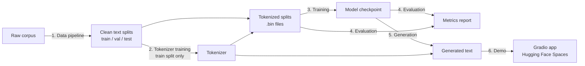

# Technical Design Doc

| | |
|---|---|
| **Project** | mini-arabic-gpt |
| **Status** | Draft |
| **Version** | 0.1 |
| **Owner** | Marwan |
| **Last updated** | 2026-10-04 |
| **Requirements** | `01-prd.md` |

## 1. Summary

This document describes how mini-arabic-gpt is built: the components of the system, how data flows between them, the artifacts each one produces, and the key technical decisions with the alternatives considered.

It defines the system at the component level. Detailed specifications for each component live in their own documents (`03` to `09`), which this doc links to. Where a decision depends on an experiment or a later spec, it is marked **provisional**.

## 2. Design principles

These principles guide every decision in this document. When two options are otherwise equal, these break the tie.

| ID | Principle | What it means in practice |
|---|---|---|
| P1 | **Correctness over speed** | Prefer the simpler implementation that is easy to verify. Optimize only after correctness is proven. |
| P2 | **Every stage is testable in isolation** | Each component has clear inputs and outputs on disk, so it can be run, inspected, and tested on its own. |
| P3 | **Reproducible by default** | Every run is fully described by a config file and a seed. Every artifact can be traced back to the config that produced it. |
| P4 | **Fail loudly** | Validate inputs and assert invariants (shapes, value ranges, vocabulary bounds). A crash is better than a silently wrong result. |
| P5 | **Small first, then scale** | Run the whole pipeline end-to-end on a tiny model and a tiny dataset before scaling either one. |

## 3. System overview

The system is a linear pipeline of six stages. Each stage reads the artifacts of the previous stage from disk and writes its own.



Detailed diagrams for each stage are in `docs/diagrams/`.

## 4. Components

### 4.1 Data pipeline

**Responsibility:** turn a raw public corpus into clean, deduplicated, split plain text.

| | |
|---|---|
| **Input** | Raw corpus downloaded from its source |
| **Output** | `data/clean/train.txt`, `data/clean/val.txt`, `data/clean/test.txt` (UTF-8) |
| **Spec** | `03-data-spec.md` |

**Steps:**

1. **Download** the corpus, or a fixed-size sample of it.
2. **Filter** documents by language purity and minimum length.
3. **Clean** each document: strip markup and boilerplate, normalize whitespace.
4. **Deduplicate** at the document level.
5. **Split** into train, validation, and test sets by document, using a fixed seed.
6. **Write** each split to disk, and record dataset statistics in a report.

**Key decisions:**

- **Split by document, not by line.** Splitting by line would place sentences from the same document in both train and test, leaking content and inflating evaluation results.
- **Deduplicate before splitting.** Otherwise copies of one document can land in different splits.
- **Text normalization** (diacritics, hamza forms, tatweel, digits) is **not** done here. It belongs to the tokenizer, so that the same rules apply at training time and at inference time. See §4.2.

### 4.2 Tokenizer

**Responsibility:** convert text to token IDs and back, consistently across training, evaluation, and the demo.

| | |
|---|---|
| **Input** | `data/clean/train.txt` |
| **Output** | Tokenizer files in `artifacts/tokenizer/`; tokenized splits `data/tokens/{train,val,test}.bin` |
| **Spec** | `04-tokenizer-spec.md` |

**Design:**

- A **subword tokenizer** (BPE or Unigram) trained on the **train split only**, so that no information from the validation or test sets leaks into it.
- **Normalization rules** are part of the tokenizer itself, not a separate preprocessing script. Any text entering the model, during training or in the demo, passes through the exact same normalization.
- The tokenizer is trained with an existing library. This is allowed under the PRD's definition of "from scratch". The library choice (Hugging Face `tokenizers` or SentencePiece) is decided in `04-tokenizer-spec.md` and recorded in an ADR.

**Tokenized storage format:**

Each split is encoded once and stored as a flat binary file of token IDs, `uint16`, read during training with NumPy memory-mapping.

- **Why:** memory-mapping reads only the slices needed for each batch, so the full dataset never has to fit in RAM. This matters with 16 GB of system RAM, often half used by other apps.
- **Constraint:** `uint16` holds values up to 65,535. **The vocabulary size must be ≤ 65,535.** A larger vocabulary would overflow silently, corrupting every token above the limit without raising an error. The encoder must assert this bound.

### 4.3 Model

**Responsibility:** given a sequence of token IDs, predict a probability distribution over the next token at every position.

| | |
|---|---|
| **Input** | Token IDs, shape `(B, T)` |
| **Output** | Logits, shape `(B, T, V)` |
| **Spec** | `05-model-architecture.md` |

`B` = batch size, `T` = sequence length (≤ context length), `V` = vocabulary size.

**Design:** a decoder-only transformer in the GPT family.

- Token embedding + position information
- `N` transformer blocks, each with causal multi-head self-attention and an MLP, using pre-layer normalization and residual connections
- Final layer normalization and a linear output head

**Fixed by this doc:**

- **Causal masking is mandatory.** A token may attend only to itself and earlier positions. This is verified by a dedicated test (see §8).
- **Written from scratch** using PyTorch primitives (`nn.Linear`, `nn.Embedding`, etc.). No pretrained weights and no model classes from `transformers` (PRD NG5).
- **Size between 10M and 30M parameters** (PRD NFR2).

**Deferred to `05-model-architecture.md`** (provisional): number of layers, heads, and embedding size; context length; positional encoding type (learned vs. rotary); weight tying between embedding and output head; dropout.

### 4.4 Training

**Responsibility:** optimize model parameters to minimize next-token prediction loss on the training split.

| | |
|---|---|
| **Input** | `data/tokens/train.bin`, `data/tokens/val.bin`, a training config |
| **Output** | `checkpoints/<run-name>/` containing checkpoints, the config, and the metrics log |
| **Spec** | `06-training-plan.md` |

**Design:**

- **Loss:** cross-entropy between the logits at position `t` and the true token at position `t+1`.
- **Batching:** random contiguous windows of `T+1` tokens sampled from the memory-mapped train file. Input is tokens `[0..T-1]`, target is tokens `[1..T]`.
- **Optimizer:** AdamW with gradient clipping. Learning-rate schedule: linear warmup, then cosine decay (provisional).
- **Mixed precision:** `bfloat16` autocast on the GPU to reduce memory use and speed up training. Blackwell GPUs support it natively.
- **Gradient accumulation:** to reach the target effective batch size within 8 GB VRAM.
- **Validation:** loss on a fixed sample of the validation split every `K` steps.
- **Checkpointing:** the model, optimizer state, step count, and config are saved every `K` steps and at the end. Training can resume from any checkpoint.

**Run directory:** every training run writes to its own folder, so runs never overwrite each other:

```
checkpoints/<run-name>/
├── config.yaml        # exact config used, including seed
├── metrics.jsonl      # one JSON line per logged step
├── ckpt_step_XXXX.pt  # periodic checkpoints
└── ckpt_final.pt
```

### 4.5 Evaluation

**Responsibility:** measure model quality against the PRD success metrics.

| | |
|---|---|
| **Input** | A checkpoint, the tokenizer, `data/tokens/test.bin`, the evaluation prompt set |
| **Output** | A metrics report (JSON + Markdown) |
| **Spec** | `07-evaluation-plan.md` |

**Design:**

- **Quantitative:** perplexity on the **full** test split, for the model and for an n-gram baseline, using the same tokenizer (PRD M1).
- **Qualitative:** continuations for a fixed set of prompts, generated with fixed settings and a fixed seed, saved for manual rating (PRD M2).
- **The test split is used only for final evaluation.** All tuning decisions use the validation split. Tuning on the test set would make the final numbers meaningless.

### 4.6 Generation

**Responsibility:** produce a continuation of an Arabic prompt.

| | |
|---|---|
| **Input** | Prompt text, generation settings |
| **Output** | Generated text |

**Design:**

- Autoregressive sampling: encode the prompt, then repeatedly predict the next token, sample it, and append it.
- **Settings:** temperature, top-k, maximum new tokens.
- If the sequence grows beyond the context length, only the most recent tokens are kept as input.
- A KV cache (an optimization that avoids recomputing past tokens) is **out of scope for v1**. Generation speed at this model size is acceptable without it.

### 4.7 Demo

**Responsibility:** let anyone try the model from a browser.

| | |
|---|---|
| **Input** | User prompt and settings from the UI |
| **Output** | Generated continuation and its tokenization |
| **Spec** | `09-ui-spec.md` |

**Design:**

- A single Gradio app in `app/app.py`. The UI and the inference logic live in the same Python file (PRD NG7).
- Hosted on Hugging Face Spaces, on **CPU** (free tier). A 10M–30M parameter model runs acceptably on CPU.
- The model checkpoint and tokenizer are downloaded from the Hugging Face Hub when the app starts, not stored in the Git repository.
- The app reuses the same `generate` and tokenizer code as the rest of the project, to guarantee identical behavior.

## 5. Artifacts

| Artifact | Produced by | Consumed by | Location | In Git? |
|---|---|---|---|---|
| Raw corpus | Download script | Data pipeline | `data/raw/` | No |
| Clean text splits | Data pipeline | Tokenizer, encoder | `data/clean/` | No |
| Dataset statistics report | Data pipeline | Data Spec, Model Card | `docs/` (summarized) | Summary only |
| Tokenizer files | Tokenizer training | Encoder, generation, demo | `artifacts/tokenizer/` | Yes (small) |
| Tokenized splits | Encoder | Training, evaluation | `data/tokens/` | No |
| Checkpoints, configs, metrics | Training | Evaluation, generation | `checkpoints/<run-name>/` | No |
| Final model | Training | Demo | Hugging Face Hub | No |
| Evaluation report | Evaluation | Model Card | `reports/` | Yes |

## 6. Repository structure

This is the target layout. It replaces the provisional layout listed in `CLAUDE.md` once this doc is approved.

```
mini-arabic-gpt/
├── docs/                    # Documentation (this file, specs, ADRs, diagrams)
├── experiments/             # Experiment log
├── configs/                 # YAML configs for data, tokenizer, training, evaluation
├── src/mini_arabic_gpt/     # Importable Python package
│   ├── config.py            # Config dataclasses + YAML loading
│   ├── data.py              # Memory-mapped dataset and batch sampling
│   ├── tokenizer.py         # Tokenizer wrapper, including normalization
│   ├── model.py             # GPT model
│   ├── train.py             # Training loop
│   ├── evaluate.py          # Perplexity and baseline evaluation
│   ├── baseline.py          # n-gram baseline model
│   └── generate.py          # Text generation
├── scripts/                 # Command-line entry points, one per pipeline stage
│   ├── prepare_data.py
│   ├── train_tokenizer.py
│   ├── encode_data.py
│   ├── train.py
│   └── evaluate.py
├── tests/                   # pytest test suite
├── app/                     # Gradio demo
│   ├── app.py
│   └── requirements.txt
├── artifacts/tokenizer/     # Trained tokenizer files (tracked)
├── reports/                 # Evaluation reports (tracked)
├── data/                    # Git-ignored
├── checkpoints/             # Git-ignored
├── pyproject.toml
├── requirements.txt
├── CLAUDE.md
└── README.md
```

**Why a separate `src/` package and `scripts/`:** the core logic in `src/` is importable by the scripts, the tests, and the demo alike. Scripts stay thin: they parse arguments, load a config, and call package functions. This keeps the logic in one place and makes every component testable without running a script.

## 7. Configuration and reproducibility

- **One YAML config per run,** loaded into typed Python dataclasses. Unknown keys raise an error, so a typo in a config can't be silently ignored.
- **Every config includes a seed.** Seeds are set for Python, NumPy, and PyTorch at the start of every run.
- **The exact config is copied into the run directory,** so any checkpoint can be traced back to the settings that produced it.
- **Dependencies are pinned** in `requirements.txt`. PyTorch is installed separately from its CUDA 13.0 index, as documented in the README.
- **Metrics are logged locally** as JSON Lines (`metrics.jsonl`) and plotted with matplotlib. No external tracking service is required.

## 8. Testing approach

Full details are in `08-testing-strategy.md`. These tests are required by this design:

| Test | What it proves |
|---|---|
| **Causal mask test** | Changing a future token does not change the model's output at earlier positions. |
| **Shape tests** | Every component produces the documented output shape. |
| **Single-batch overfit test** | The model and training loop can drive loss on one small batch close to zero. If they can't, something is broken. |
| **Tokenizer round-trip test** | `decode(encode(text))` returns the normalized text unchanged. |
| **Vocabulary bound test** | All token IDs fit in `uint16`. |
| **Split integrity test** | No document appears in more than one split. |
| **Checkpoint resume test** | Resuming from a checkpoint reproduces the same next steps. |

## 9. Silent failure modes

The most dangerous bugs in this project produce wrong results without errors. Each one has a dedicated safeguard.

| Failure | Symptom | Safeguard |
|---|---|---|
| Missing or wrong causal mask | Validation loss drops implausibly fast; generation is poor | Causal mask test |
| Targets not shifted by one position | Loss near zero almost immediately | Single-batch overfit test + reviewing the first loss values |
| Test data leaked into training or tokenizer | Test perplexity is unrealistically low | Document-level split, dedup before split, split integrity test |
| Token IDs overflow `uint16` | Corrupted training data, degraded model | Vocabulary bound assertion in the encoder |
| Arabic text corrupted by non-UTF-8 I/O | Garbled tokens, odd vocabulary | Explicit `encoding="utf-8"` everywhere; vocabulary inspection |
| Different normalization at training vs. inference | Demo output worse than evaluation results | Normalization built into the tokenizer, shared by all stages |
| Perplexity compared across different tokenizers | Misleading comparison | Evaluation refuses to compare runs with different tokenizer files |
| Training silently running on CPU | Training is extremely slow | Startup check asserts the device is CUDA and logs the GPU name |

## 10. Key decisions

Each decision gets a full ADR in `docs/adr/` before or during implementation.

| ID | Decision | Alternatives considered | Rationale |
|---|---|---|---|
| D1 | Linear pipeline of independent stages that communicate through files on disk | A single end-to-end script | Each stage can be inspected and tested in isolation (P2) |
| D2 | Tokenized data stored as `uint16` memory-mapped binary files | Load all tokens into RAM; PyTorch `Dataset` of text lines | Low RAM use, fast random access. Requires vocab ≤ 65,535 |
| D3 | YAML configs loaded into typed dataclasses | Command-line flags only; Hydra | Configs are saved with each run; dataclasses catch typos. Hydra adds complexity we don't need |
| D4 | Local metric logging (JSONL + matplotlib) | Weights & Biases; TensorBoard | No external account or service; results stay in the repo. Can be revisited |
| D5 | `bfloat16` mixed precision | Full `float32`; `float16` with loss scaling | Less memory and faster than `float32`; no loss scaling needed, unlike `float16` |
| D6 | `src/` package + thin `scripts/` | Jupyter notebooks; flat scripts | Logic is importable by tests and the demo; notebooks are hard to test and review |
| D7 | Gradio demo on Hugging Face Spaces (CPU) | Streamlit; custom React + FastAPI | Standard for ML demos; free hosting; minimal code (PRD NG7) |
| D8 | Tokenizer library: Hugging Face `tokenizers` or SentencePiece | Writing BPE from scratch | **Provisional,** decided in `04-tokenizer-spec.md` |
| D9 | `pytest` for testing | `unittest` | Simpler syntax; the de facto standard |

## 11. Alternatives rejected at the system level

| Alternative | Why rejected |
|---|---|
| **Forking an existing implementation** (e.g. nanoGPT) | Would make the project a copy rather than an implementation; weakens the portfolio value. Existing implementations remain valid **references** for checking our work. |
| **Using Hugging Face `transformers` model classes** | Violates the from-scratch goal (PRD NG5). |
| **Notebook-only project** | Hard to test, review, and reproduce; doesn't reflect professional engineering practice. |

## 12. Open questions

| Question | Resolved in |
|---|---|
| Which corpus, and how many tokens? | `03-data-spec.md` |
| Tokenizer library, algorithm, vocabulary size, normalization rules | `04-tokenizer-spec.md` |
| Layers, heads, embedding size, context length, positional encoding | `05-model-architecture.md` |
| Batch size, learning rate, schedule, number of steps | `06-training-plan.md` |
| Which n-gram baseline (order, smoothing) | `07-evaluation-plan.md` |

## 13. Related documents

- `01-prd.md`: requirements this design satisfies
- `03-data-spec.md` to `09-ui-spec.md`: detailed component specs
- `docs/adr/`: decision records
- `docs/diagrams/`: detailed diagrams