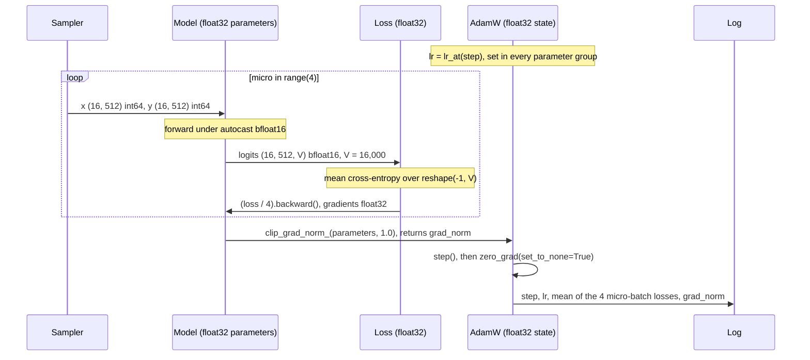
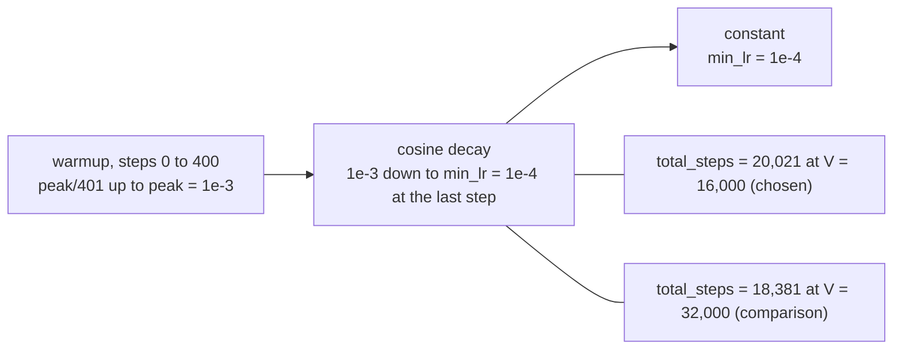
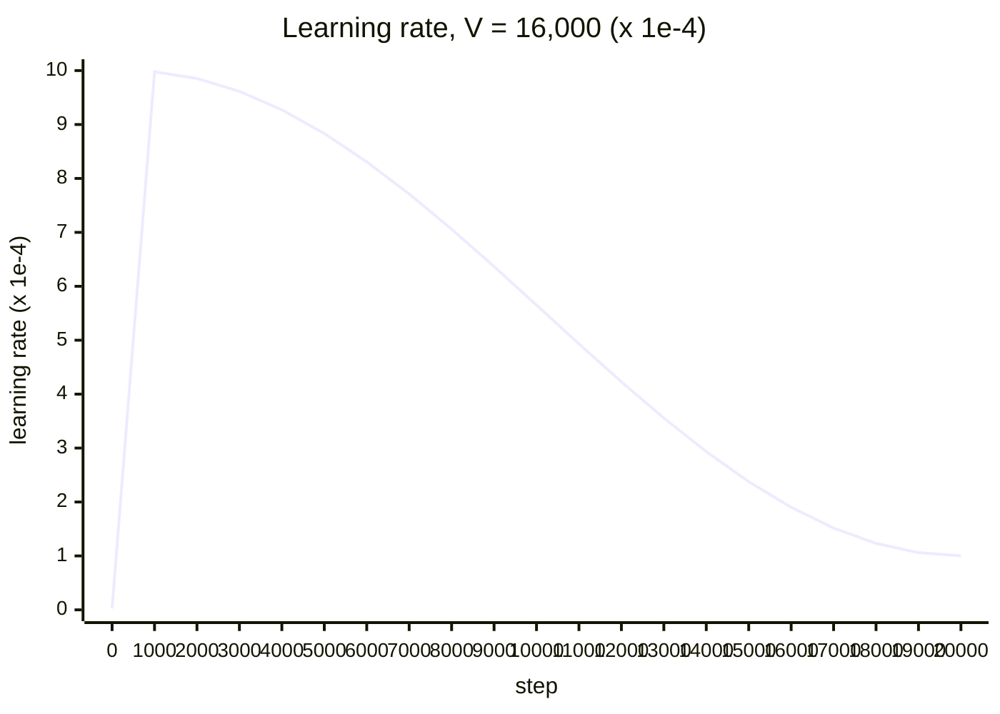
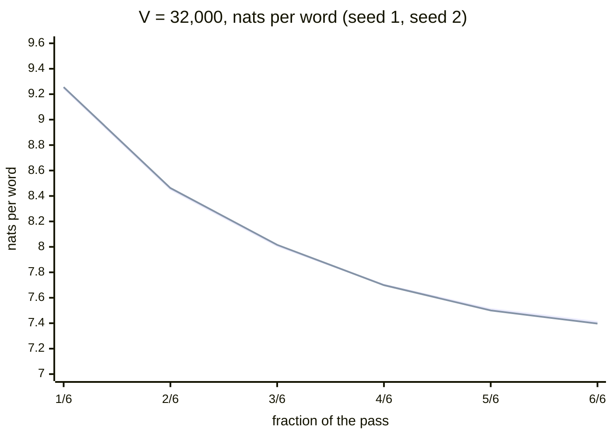
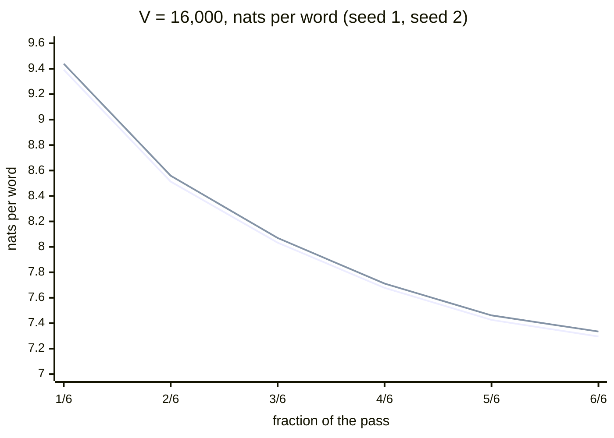
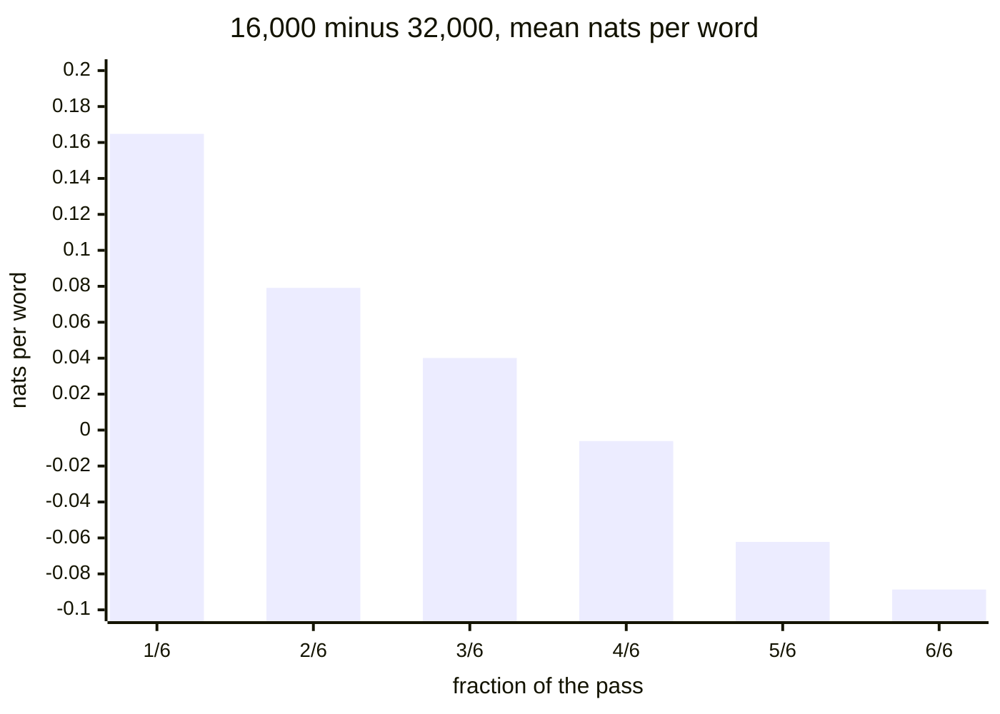

# Training Plan

| | |
|---|---|
| **Project** | mini-arabic-gpt |
| **Status** | Draft, pending ADR-0004 |
| **Version** | 0.1 |
| **Last updated** | 2026-10-10 |
| **Depends on** | `01-prd.md` (M3, M4, NFR3), `02-design-doc.md` §4.4, §7, §9, D3, D4, D5, `03-data-spec.md` §10, `04-tokenizer-spec.md` §10, `05-model-architecture.md` (parameter count, FLOPs per token, memory), `docs/adr/0001-training-corpus.md` (Amendment 1), `docs/adr/0002-tokenizer.md` (Amendment 1), `docs/adr/0003-model-architecture.md` |
| **Feeds** | `07-evaluation-plan.md` (checkpoints, metrics log, validation protocol), `08-testing-strategy.md` (training-loop tests), `11-roadmap.md` (run schedule) |

## 1. Purpose and scope

This document specifies how the model of `05-model-architecture.md` is trained: data sampling, optimizer, learning-rate schedule, batch size, precision, evaluation during training, checkpoints and resume, logging, failure handling, and the run plan (one pilot, one main run, one spare).

It also reports the **vocabulary-size pilot** (§7): two matched short runs of the `base` model at 16,000 and 32,000 vocabulary entries, which `05-model-architecture.md` §12 left open and `04-tokenizer-spec.md` §10 decides.

**Status of numbers.** Every measured number below was produced by throwaway code in the session scratchpad on the project machine (RTX 5050 Laptop, 7.96 GiB), not by the production pipeline, which does not exist yet. They are labelled **preliminary (scratchpad, not the production pipeline)**. Commands and outputs are in Appendix A. The production pipeline re-measures the ones that matter (§6).

**Vocabulary.** **V = 16,000**, per ADR-0002 Amendment 1 (decided by the author on the evidence of §7). All `base` figures in this document are for V = 16,000: 16,967,424 parameters (`05` formula, §5.3), 328.0M train tokens (preliminary), 20,021 steps, about 2.4 hours. The 32,000 column is kept for comparison only. `05-model-architecture.md` still shows V = 32,000 as provisional; its update is a proposed edit (§11, item 3).

**Terms (added in Part D).** "Scratchpad pilot" means a throwaway experiment run in the session scratchpad before the production code exists: the vocabulary pilot of `06` §7 and the pilot model of `07`. "Production pilot" means the first run of the production code before the main run (`06` §6, gates P-a to P-d). In this document, "the pilot" means the scratchpad pilot, except where it refers to the run plan of §6 or to the gates P-a to P-d, where it means the production pilot; the full term is written where a reader could confuse them.

**Out of scope:** the evaluation protocol on the test split (`07`), tests (`08`), the model itself (`05`).

## 2. Requirements

| ID | Requirement | Source |
|---|---|---|
| TP1 | Train the `base` model of `05` on the train split with next-token cross-entropy. Targets are the inputs shifted by one position. | Design §4.4 |
| TP2 | One full run completes in under 6 hours and within 8 GB of VRAM (measured as reserved memory against 7.96 GiB). | PRD M3, NFR3 |
| TP3 | A run can be re-executed from its saved config and seed. | PRD M4 |
| TP4 | The tokenizer is trained on the train split only, and validation and test documents never enter training. The training code only reads `train.bin` for gradient updates. | CLAUDE.md, Data Spec §10 |
| TP5 | Before any full run: the model overfits a single small batch to near-zero loss. | CLAUDE.md |
| TP6 | Seeds are set and logged; the full config is saved with every run and checkpoint. | CLAUDE.md, Design §7 |
| TP7 | Startup asserts the device is CUDA and logs the GPU name. | Design §9 |
| TP8 | Training can resume from a checkpoint and reproduce the same next steps. | Design §8 |
| TP9 | Metrics are logged locally as JSON Lines. | Design D4 |
| TP10 | Every training setting is a field of a typed config; unknown keys are an error. | Design §7, D3 |
| TP11 | A suspicious loss curve (too fast, or non-finite) stops the run and is investigated before continuing. | CLAUDE.md |

## 3. Decisions at a glance

Status: **Fixed** = set by an earlier document; **Decided** = decided with the author's agreement (Q1 to Q4 of the planning questions); **Provisional** = depends on a measurement named in §9.

| ID | Decision | Status | Evidence |
|---|---|---|---|
| T1 | Fixed budget of **2 epochs** over the train split; keep the best-validation checkpoint as well as the final one | Decided | Author; `05` §6.3, ADR-0001 Amendment 1 |
| T2 | Optimizer: AdamW, betas (0.9, 0.95), epsilon 1e-8, fused implementation | Provisional | §4.3 |
| T3 | Weight decay 0.1 on tensors with two or more dimensions (including the embedding matrices); none on LayerNorm parameters | Provisional | §4.3 |
| T4 | Gradient clipping at global norm 1.0 | Provisional | §4.3 |
| T5 | Peak learning rate 1e-3, minimum 1e-4, linear warmup of 400 steps, cosine decay over the whole run | Provisional | §4.4 |
| T6 | Effective batch **32,768 tokens** = micro-batch 16 sequences × 4 accumulation steps × 512 | Provisional | §4.5 |
| T7 | `bfloat16` autocast, `float32` parameters, gradients and optimizer state, no gradient scaler | Fixed (D5); no-scaler check in §8 | `05` §4.8 |
| T8 | Validation on the **full** validation split every 1,000 steps and at the end; the evaluation batch is 8 sequences | Decided | §4.7 |
| T9 | Window sampler: per epoch, non-overlapping windows of `T`+1 tokens at a random offset, visited in random order; the order is a function of (seed, epoch, step) | Decided | §4.1 |
| T10 | Checkpoints: `ckpt_latest` every 1,000 steps, `ckpt_best` when validation improves, `ckpt_step_{n}` every 5,000 steps, `ckpt_final` | Decided | §4.8 |
| T11 | No `torch.compile` in v1 | Decided | §4.6 |
| T12 | Run plan: one pilot, one main run, one spare | Decided | §6 |
| T13 | Vocabulary size chosen by validation loss per word of matched short runs, not by tokens per word | Decided (rule) | §7 |
| T14 | **V = 16,000** (ADR-0002 Amendment 1), re-confirmed by repeating the §7 comparison on the production tokenizer and splits (`04` §10, proposed rule) | Decided (author); result preliminary | §7 |

## 4. Training procedure

### 4.1 Data and sampling

- **Input:** `data/tokens/train.bin` and `val.bin` (`uint16`, one `<|endoftext|>` after every document, `03` and `04` §3 to §7), memory-mapped (Design D2).
- **Windows.** A window is `T`+1 = 513 consecutive tokens; the input is tokens `[0..T-1]` and the target `[1..T]`, so the targets are the inputs shifted by one. Windows may span documents with `<|endoftext|>` as the only separator (`05` §4.9).
- **Epochs.** Per epoch `e`, draw an offset `o_e` uniformly from `[0, T)` and use the windows starting at `o_e + i·T` (`i = 0, 1, …`) in a random permutation. Within one epoch every token (except a tail shorter than a window) is used exactly once as input, so "2 epochs" is exactly two passes over the data. Epoch 2 gets a different offset and permutation, so its windows are not a repeat of epoch 1's.
- **Determinism.** The offset and the permutation come from `numpy.random.Generator(PCG64([seed, epoch]))`, so the batch at any step is a pure function of (seed, epoch, step). This is what makes resume exact (§4.8) without saving sampler state.
- **This refines Design §4.4**, which says "random contiguous windows" without saying whether they are drawn with replacement; sampling with replacement would make "epochs" ill-defined and the repetition level unknown.
- The pilot code used the same sampler without the random offset (windows at multiples of `T`, one permutation); its results are unaffected by the offset.

### 4.2 One optimizer step

```
for step in range(start_step, total_steps):
    lr = lr_at(step); set lr in every parameter group
    for micro in range(4):                                  # accumulation
        x, y = next micro-batch                             # (16, 512), (16, 512) int64
        with autocast(bfloat16): logits, loss = model(x, y) # logits (16, 512, V), loss = mean cross-entropy
        (loss / 4).backward()                               # gradients average over the 4 micro-batches
    grad_norm = clip_grad_norm_(parameters, 1.0)
    optimizer.step(); optimizer.zero_grad(set_to_none=True)
```



Diagram file: [04-one-optimizer-step.md](diagrams/04-one-optimizer-step.md)

- Loss scaling by 1/4 and equal-size micro-batches make the accumulated gradient equal the gradient of one batch of 64 sequences. Measured on `tiny` in `float32`: the maximum gradient difference between one batch of 16 and 8 micro-batches of 2 with loss/8 is 5.6e-9 (gradient magnitudes up to 1.0e-2); without the scaling the gradient is 8.0 times too large (Appendix A.2). The equality needs every micro-batch to have the same number of target tokens; that holds here because there is no padding or ignored target. If padding or masked targets ever appear, the loss must be normalized by the total number of target tokens instead.
- The loss is `float32` cross-entropy over `reshape(-1, V)` of the logits and `reshape(-1)` of the targets (`05` §9: `view` fails on the sliced targets).
- The logged training loss is the mean of the 4 micro-batch losses.

### 4.3 Optimizer

| Setting | Value | Source |
|---|---|---|
| Algorithm | AdamW (decoupled weight decay, [Loshchilov and Hutter](https://arxiv.org/abs/1711.05101)); PyTorch's `AdamW` documents "weight decay does not accumulate in the momentum nor variance" | [torch.optim.AdamW](https://docs.pytorch.org/docs/2.14/generated/torch.optim.AdamW.html) |
| Betas | (0.9, 0.95) | nanoGPT's GPT-2 configuration (`beta1 = 0.9`, `beta2 = 0.95`, [train.py](https://github.com/karpathy/nanoGPT/blob/master/train.py)). The baby-GPT config uses 0.99 "because number of tokens per iter is small" ([train_shakespeare_char.py](https://github.com/karpathy/nanoGPT/blob/master/config/train_shakespeare_char.py)); the pilot (8,192 tokens per step) trained stably at 0.95 |
| Epsilon | 1e-8 (PyTorch default) | AdamW docs |
| Weight decay | 0.1 on tensors with `dim >= 2` (all `Linear` weights and both embedding matrices, the tied matrix once); 0 on `LayerNorm` weight and bias | nanoGPT `configure_optimizers` and `weight_decay = 1e-1` |
| Implementation | `fused=True` (supports `float32` and `bfloat16`, documented) | AdamW docs |
| Gradient clipping | global L2 norm 1.0, `torch.nn.utils.clip_grad_norm_` (in place, over all parameters as one vector) | nanoGPT `grad_clip = 1.0`; [PyTorch docs](https://docs.pytorch.org/docs/2.14/generated/torch.nn.utils.clip_grad_norm_.html) |

**Provisional.** These values are taken from nanoGPT's configurations for 124M and 11M-parameter models; none was tuned here. Weight decay on the embedding matrices follows nanoGPT's rule and is not verified to be best. In the pilot the clip was active in 50 and 56 of 3,366 steps (32k, seeds 1 and 2; 1.5% to 1.7%) and in 38 and 40 of 3,673 steps (16k; about 1.1%), mainly in the first steps when the gradient norm is 3.7 to 4.5; the median gradient norm was 0.70 (32k) and 0.71 (16k), the 95th percentile 0.86 to 0.88 (Appendix A.3).

### 4.4 Learning-rate schedule

Linear warmup for 400 steps from `peak/401` to `peak`, then cosine decay to `min_lr` at the last step, then constant `min_lr` (the shape of nanoGPT's `get_lr`).

| | Value | Basis |
|---|---|---|
| Peak | 1e-3 | Stable in the pilot on this architecture (8,192 tokens per step, no divergence, max gradient norm 4.5 at step 1). nanoGPT uses 1e-3 for its 11M-parameter model at 16,384 tokens per step and 6e-4 for 124M at 491,520 tokens per step |
| Minimum | 1e-4 | One tenth of peak: nanoGPT `min_lr` "should be ~= learning_rate/10 per Chinchilla", and [Hoffmann et al.](https://arxiv.org/abs/2203.15556) recommend a cosine cycle that "decays 10× over approximately D tokens" |
| Cycle length | the whole run (`total_steps`) | same source |
| Warmup | 400 steps (about 2% of the run) | nanoGPT baby config 100 of 5,000 steps; the pilot used 100 of 3,366 |

**Provisional.** The peak learning rate was not searched. At 4 times the pilot's batch (T6) 1e-3 is a guess that the pilot makes plausible, not a measurement. **Fallback: 6e-4** (the GPT-2 value), used by the spare run if the main run shows instability (§6).





Diagram file: [05-learning-rate-schedule.md](diagrams/05-learning-rate-schedule.md)

Run lengths with these settings: `total_steps` = ⌈2 × tokens in the train split / 32,768⌉; at the preliminary supply 20,021 steps at V = 16,000 (18,381 at 32,000) (§5).

### 4.5 Batch size

Micro-batch 16 sequences (8,192 tokens) because it was the largest comfortable size in `05` §8.2 (4.88 GiB allocated, 5.66 GiB reserved with the real loader; Appendix A.4), times 4 accumulation steps: **32,768 tokens per optimizer step**.

**Provisional.** The choice is a compromise between the pilot's measured-stable 8,192 tokens and the 16,384 to 491,520 used in the nanoGPT references. The sources only say that the useful batch size depends on the task and can be estimated from the gradient noise scale ([McCandlish et al.](https://arxiv.org/abs/1812.06162)); the noise scale was not measured. A larger batch means fewer updates for the same data: 32,768 tokens gives about 18,000 updates in two epochs, 65,536 gives about 9,200. The production pilot (§6) checks the choice (gate P-d).

### 4.6 Precision, memory, and speed

- **Precision.** `05` §4.8: `bfloat16` autocast around the forward pass and loss only; parameters, gradients, and AdamW state `float32`; no scaler. The pilot ran 4 runs × about 3,400 steps with no non-finite value and a smooth loss, which supports "no scaler"; it is checked again in the main run by the non-finite check (§4.10).
- **Memory.** Training at micro-batch 16 reserves 5.66 GiB (32k) or 3.68 GiB (16k) of 7.96 GiB. Static memory is 16 bytes per parameter (`05` §8.2).
- **Evaluation memory.** The pilot's first version evaluated with 32 sequences at once and converted the logits to `float32`: the evaluation peak was 5.21 GiB allocated and **8.0 GiB reserved**, and during the pilot the process reserved 9.56 GiB, more than the card has. Windows then uses shared system memory and throughput drops (`05` §8.2). With an evaluation batch of 8 the peak is 1.54 GiB allocated and 2.31 GiB reserved (Appendix A.4). The evaluation batch is therefore fixed at 8 (T8), and the training loop calls `torch.cuda.empty_cache()` after each evaluation. The pilot's wall-clock times (764 s for 32k, 523 s for 16k) are not valid throughput figures; the losses are not affected.
- **`torch.compile`: not used** (T11). The measured throughput is not the constraint (§5), the explicit attention is the specification (`05` §4.3), and compilation on Windows was not tested here.
- **Data loading.** Windows are cut from the memory-mapped array in the main process; the measured throughput including this (60.7k tokens/s at 32k) is within 4% of the benchmark without a loader (63k), so no worker processes are planned.

### 4.7 Validation during training

- Evaluate the **full validation split** (about 3.34M tokens, about 6,500 windows of 512 at 16k; 3.06M tokens and 5,980 windows at 32k) every 1,000 steps and at the end. Measured cost: 6.6 s per 1.0M tokens at evaluation batch 8, so about 22 s per evaluation and about 7 minutes for 20 evaluations (5.0% of a 2.44-hour run; at 32k about 20 s, 6 minutes for 18 evaluations, 3.6% of a 2.8-hour run).
- Windows are non-overlapping (stride `T`), so the first tokens of each window are predicted with little context. The same windows are used for every run and vocabulary, which keeps runs comparable. `07-evaluation-plan.md` defines the evaluation protocol for the test split. The final evaluation uses a strided window (512 with stride 256) as its primary protocol (`07` §4.3), so its numbers are not interchangeable with the non-overlapping validation losses logged here.
- Logged: validation loss per token (nats), validation loss per word (nats; total negative log-likelihood divided by the number of whitespace-separated words of the validation documents, 2,071,980 in the pilot sample), and the corresponding perplexities. **Per-token numbers are comparable only between runs with the same tokenizer** (CLAUDE.md); per-word numbers can be compared across vocabularies, within the limits in §7.
- The validation split is used to select the best checkpoint and for decisions in this document; the test split is not read by training code.

### 4.8 Checkpoints and resume

| File | Written | Contents |
|---|---|---|
| `ckpt_latest.pt` | every 1,000 steps (after evaluation); written to a temporary file and renamed, so a crash cannot leave a half-written file | model, optimizer, step, epoch, best validation loss, config, seed, tokenizer file hash, git commit, package versions |
| `ckpt_best.pt` | when the full-validation loss improves | same |
| `ckpt_step_{n}.pt` | every 5,000 steps | same |
| `ckpt_final.pt` | at the last step | same |
| `model_final.pt` | at the end | model weights only (about 92 MB, `float32`), for evaluation and the demo |

- **Size.** 12 bytes per parameter (weights + two moments) = 277 MB for `base` at 32k, 204 MB at 16k (Appendix A.5). With `latest`, `best`, `final` and one file per 5,000 steps (3 to 4 files) the run directory is about 1.4 GB; 17 GB of disk were free on the project machine (Appendix A.5).
- **Resume.** Load the checkpoint, restore model, optimizer, and `step`; the sampler needs no state (§4.1). The tests in `08` are: (1) train 20 steps in one go; train 10, save, load, train 10 more; the 20 training losses agree. On this machine, with the explicit attention, two runs with the same seed gave bit-identical losses for 150 steps (Appendix A.6), so the test can demand exact equality here and falls back to a small tolerance only if it fails on other hardware; (2) the resumed run reaches the same final validation loss.
- This is the periodic-checkpoint scheme of Design §4.4, with the naming and retention made explicit.

### 4.9 Run directory and logging

`checkpoints/<run-name>/` (git-ignored, Design §4.4): `config.yaml`, `metrics.jsonl`, the checkpoints above, `env.json` (Python, PyTorch, CUDA, GPU name, `tokenizers` version, git commit and whether the working tree was dirty).

`metrics.jsonl`, one line per event:

| Event | Every | Fields |
|---|---|---|
| `train` | 10 steps | step, epoch, tokens seen, learning rate, training loss (mean over the 10 steps), gradient norm (before clipping), tokens per second, peak allocated GiB |
| `val` | 1,000 steps | step, tokens seen, validation loss per token and per word, perplexities, evaluation seconds |

The loss is accumulated on the GPU and read back once per 10 steps, avoiding a synchronization on every step.

```yaml
train:                        # sketch (Design §7); unknown keys are an error
  seed: 1
  run_name: base-v16k-s1
  epochs: 2
  micro_batch: 16
  accum_steps: 4              # tokens per step = micro_batch x accum_steps x context_length
  lr: 1.0e-3
  min_lr: 1.0e-4
  warmup_steps: 400
  betas: [0.9, 0.95]
  weight_decay: 0.1
  grad_clip: 1.0
  eval_every: 1000
  eval_batch: 8
  checkpoint_every: 1000
  keep_every: 5000
```

### 4.10 Failure handling

| Event | Detection | Action |
|---|---|---|
| Non-finite loss or gradient norm | checked every step (a flag accumulated on the GPU and read at logging) | stop immediately; do not save over `ckpt_latest`; investigate (TP11) |
| Loss spike | training loss over 10 steps more than 2× the median of the previous 100 logged values, or gradient norm above 5× its median | log a warning; continue; if the loss has not returned within 500 steps, stop and use the spare run with the fallback learning rate |
| Out of memory | exception | lower `micro_batch` and raise `accum_steps` to keep 32,768 tokens; resume from `ckpt_latest` |
| Reserved memory above 7.5 GiB | logged at each evaluation | treat as a warning: shared-memory spill starts at 7.96 GiB |
| Crash or reboot | — | resume from `ckpt_latest` |
| Validation loss rises while training loss falls | validation curve | see §9 (dropout) |
| Loss implausibly low early | first 5 logged losses against ln `V` (9.68 at V = 16,000, the chosen vocabulary; 10.37 at 32k) | the first logged loss must be within 0.5 of ln `V`; otherwise stop (shifted targets, wrong mask) |

## 5. Compute budget

Measured with the real token file, the window sampler, micro-batch 16 × 8 accumulation (the number of accumulation steps does not change the per-token cost), clipping, and fused AdamW; 12 timed steps after 3 warm-up steps (Appendix A.4). **Preliminary (scratchpad, not the production pipeline).**

| | 32,000 (comparison) | **16,000 (chosen)** |
|---|---|---|
| Parameters (`05` §5) | 23,111,424 | 16,967,424 |
| Tokens per second | 60.7k | 74.6k |
| Peak allocated / reserved, training (GiB) | 4.88 / 5.66 | 3.31 / 3.68 |
| Train-split tokens `S` (`05` §6.1, §12; preliminary) | 301.2M | 328.0M |
| Tokens in 2 epochs | 602.4M | 656.0M |
| Steps at 32,768 tokens | 18,381 | 20,021 |
| Training time, 2 epochs | **2.76 h** | **2.44 h** |
| Plus validation (18 to 20 evaluations × 20 s) and checkpoints | about +0.1 h | about +0.1 h |

The 6-hour limit (M3) leaves room for 2 epochs with 3 hours to spare. The time per token is the 63k tokens/s of `05` §8.3 reduced by 4%, which is the cost of the loader, clipping, and gradient accumulation. Not measured: the first-token latency of the first step (compilation or caching), checkpoint write time, and the effect of Windows background load. The main run's time is computed from a throughput measured while nothing else ran.

## 6. Run plan

| Run | Purpose | Cost | Pass criteria |
|---|---|---|---|
| **Pilot** (production code, before the main run) | (a) `tiny` overfit; (b) about 10 minutes of `base` | 10 to 15 min | P-a: `tiny` single-batch loss below 0.01 in 300 steps (scratchpad: 0.0002); P-b: `base` loss finite, first loss within 0.5 of ln `V`, validation loss decreasing at every evaluation, throughput at least 68k tokens/s (V = 16,000; measured 74.6k), reserved memory below 7.0 GiB; P-c: the resume test of §4.8 passes; P-d: validation loss per word after the pilot is not more than 0.15 nats above the scratchpad pilot's 7.32 (V = 16,000; mean of two seeds) at the same number of tokens seen; if it is, set batch to 16,384 tokens (accumulation 2) and repeat the pilot |
| **Main** | 2 epochs, the settings of §4, V = 16,000 | about 2.6 h (2.44 h + evaluations) | Finite loss throughout; validation loss at the end below the pilot's; best checkpoint kept; results go to `07` |
| **Spare** | Held for one failure: divergence or instability (peak learning rate 6e-4), an out-of-memory fix, a data-pipeline bug found late, or the dropout fallback (§9) | about 2.6 h | Same as main |

The author decided (Q2) on this budget. There is no hyperparameter sweep. The vocabulary decision (§7) is made before the pilot; its measurements are the "pre-pilot" below. Calendar placement of these runs belongs to `11-roadmap.md`.

## 7. Vocabulary pilot: 16k against 32k

**Question** (`05` §12, `04` §10): which vocabulary size gives the better model? The previous rule compared tokens per word; the author decided to use validation loss per word of matched short training runs instead.

### 7.1 Design

| Item | Detail |
|---|---|
| Model | `base` of `05` at V = 16,000 (16,967,424 parameters) and V = 32,000 (23,111,424); the 10,626,816 non-embedding parameters are identical |
| Data | the seeded 10% sample of cleaned Wikipedia of `05` §6.2: 43,190 training documents, 18,726,882 words; 4,858 held-out documents, 2,071,980 words. Same documents in the same order for both vocabularies; the vocabulary is trained on those training documents only |
| Tokenizers | trial byte-level BPE (`05` §6.2, approximations of the `04` rules, N13 not applied), one per vocabulary size |
| Tokens | train: 30,094,429 (16k) and 27,575,322 (32k); held-out: 3,335,119 and 3,062,162 (including one `<\|endoftext\|>` per document) |
| Matching | **matched on text:** one pass over the same documents, so both models see the same 18.7M words. At equal tokens per step (8,192) the 16k model takes 3,673 steps and the 32k model 3,366 |
| Settings | the settings of §4 except: batch 8,192 tokens (micro-batch 16, no accumulation), peak learning rate 1e-3, minimum 1e-4, warmup 100 steps, cosine over the run, windows at multiples of 512 |
| Seeds | 2 per vocabulary (1 and 2): they change the initialization and the window order |
| Metric | validation loss per word: total negative log-likelihood (nats) on the held-out documents divided by 2,071,980 words; windows of 512 tokens, stride 512 |

### 7.2 Results (preliminary)

Validation loss per word (nats) at 1/6, 2/6, … 6/6 of the pass over the text (the same fractions of the same text for both vocabularies):

| Fraction of the pass | 32k seed 1 | 32k seed 2 | 16k seed 1 | 16k seed 2 |
|---|---|---|---|---|
| 1/6 | 9.2469 | 9.2556 | 9.3926 | 9.4394 |
| 2/6 | 8.4517 | 8.4624 | 8.5131 | 8.5591 |
| 3/6 | 8.0068 | 8.0160 | 8.0329 | 8.0700 |
| 4/6 | 7.7024 | 7.6991 | 7.6777 | 7.7116 |
| 5/6 | 7.5114 | 7.5005 | 7.4261 | 7.4615 |
| **6/6 (end)** | **7.4103** | **7.3971** | **7.2954** | **7.3347** |

| | 32k | 16k |
|---|---|---|
| Final loss per word, mean of 2 seeds | 7.4037 | **7.3150** |
| Seed-to-seed spread (difference between the two seeds) | 0.013 | 0.039 |
| Final perplexity per word, seeds 1 / 2 | 1,653 / 1,631 | 1,474 / 1,533 |
| Final loss per token (nats), seeds 1 / 2 | 5.0148 / 5.0059 | 4.5330 / 4.5574 |
| Training tokens per parameter | 1.19 | 1.77 |
| Peak allocated memory in training only, `B` = 16 (GiB) | 4.88 | 3.31 |

**Gap:** 16k is lower by 0.089 nats per word (8.5% lower perplexity per word) on the mean, and lower in both seed pairs (by 0.115 and 0.062). The larger seed spread is 0.039. The result holds in both pairs and exceeds the spread, but two seeds per arm is too few for a significance statement.

**Per-word normalization check** (confirms the per-word numbers use the same denominator and the same text for both vocabularies; Appendix A.7):

| | 16k | 32k |
|---|---|---|
| Held-out documents | 4,858 | 4,858 |
| Denominator: whitespace-separated words of the cleaned held-out text (the same file for both) | 2,071,980 | 2,071,980 |
| `<\|endoftext\|>` tokens, one per document, included in the scored tokens | 4,858 | 4,858 |
| Held-out tokens | 3,335,119 | 3,062,162 |
| Target tokens scored (6,513 and 5,980 non-overlapping windows × 512) | 3,334,656 | 3,061,760 |
| Tokens not scored (the tail shorter than a window) | 463 (0.014%) | 402 (0.013%) |
| Loss per token × tokens scored ÷ words (seed 1 / 2) | 7.2954 / 7.3347 | 7.4103 / 7.3971 |
| Logged loss per word (seed 1 / 2) | 7.2954 / 7.3347 | 7.4103 / 7.3971 |

The loss per word is exactly the total negative log-likelihood over the scored tokens divided by the words of all held-out documents. The unscored tail is 0.013% to 0.014% of the tokens in both cases, so omitting it changes a loss of about 7.3 nats by at most about 0.001 nats, which is 1% of the 0.089 gap and below the seed spread. The `<|endoftext|>` cost is counted for both vocabularies in the same way (one per document). The per-word number therefore measures the cost of modelling the same text, including the document boundary, with the vocabulary as the only difference.







Diagram file: [06-vocabulary-pilot-curves.md](diagrams/06-vocabulary-pilot-curves.md)

### 7.3 How far to trust it

1. **The 32k model leads for the first half of the pass; 16k overtakes at 4/6 and leads from then on** (table above). The final gap therefore depends on the end of the schedule, where the learning rate decays.
2. **Training tokens per parameter are 1.2 to 1.8**, far below the 20 of `05` §6.3. In this regime a smaller model is expected to do relatively better than at the main run's 19.5 to 26.1 tokens per parameter. The pilot does not show whether 16k keeps the lead when both models are trained for 2 epochs on 300M tokens. It is evidence about short training, not about the main run.
3. The comparison is matched on text, so the 16k model took 9.1% more optimizer steps and about as much compute per word (smaller logits, more tokens).
4. The windows are 512 tokens: 16k covers about 318 words per window and 32k about 347, so the 16k model has less context per window (a disadvantage for 16k, included in the result).
5. The tokenizers are the trial ones (8.7% of the corpus's words, approximated normalization). The held-out documents are not part of the final validation or test split.
6. One learning rate and one batch size were used for both; a different optimum for each vocabulary is not excluded.

### 7.4 Consequence: decision

**Decided by the author: V = 16,000**, recorded in ADR-0002 Amendment 1. This applies the rule of §7 (lower validation loss per word by a margin above the seed spread: 0.089 against 0.039). The longer 2-epoch matched comparison considered as an alternative is **not scheduled**; the spare run stays reserved for failures (§6).

The limits in §7.3 remain, in particular caution 2 (the pilot trains at 1.2 to 1.8 tokens per parameter, a regime that favours the smaller model). They are the reason the decision is re-confirmed by repeating the §7 comparison on the production tokenizer and splits (the rule proposed for `04` §10, §11 item 1). If the repeat disagrees (32k lower by more than the seed spread), the vocabulary is reopened and ADR-0002 is amended again.

Consequences of V = 16,000 for the plan (all from the formulas in `05` and the measurements above): 16,967,424 parameters, 6.14M fewer than at 32k, still inside NFR2; 328.0M train tokens, so 2 epochs are 38.7 tokens per parameter (29.0 at 1.5 epochs); 3.31 GiB allocated and 3.68 GiB reserved in training; 74.6k tokens/s; 20,021 steps; about 2.44 hours.

### 7.5 Proposed change to `04-tokenizer-spec.md` §10

The rule is changed from tokens per word to validation loss per word (listed also in §11, item 1).

## 8. Verification before the main run

Each check is a test or a logged check in `08-testing-strategy.md`.

| Check | Status |
|---|---|
| Single-batch overfit of `tiny` | Done in scratchpad, twice (`05` §9: 10.407 → 0.0 in 300 steps; here with the pilot code and the 16k tokenizer: 9.69 → 0.0002 in 300 steps, Appendix A.1). Repeats in the pilot (P-a) |
| First loss near ln `V` | Done in scratchpad (`05` §9: 10.4373 against 10.3735); repeated in the pilot (P-b) |
| Gradient accumulation equals one large batch | Done in scratchpad (§4.2) |
| Same seed gives the same losses | Done in scratchpad: 150 of 150 steps bit-identical (Appendix A.6) |
| Resume reproduces the next steps | Pilot (P-c) |
| No NaN or infinity under `bfloat16` without a scaler | 4 pilot runs of about 3,400 steps: none. Main run: checked every step |
| Evaluation memory fits | Fixed (§4.6); the pilot logs reserved memory |
| Train, validation, and test documents do not overlap | `08` split-integrity test (Data Spec §10) |

## 9. Provisional decisions and how each is confirmed

| Decision | Confirmed or changed by |
|---|---|
| Peak learning rate 1e-3 (T5) | Pilot P-b and the main run's early loss curve and gradient norms; fallback 6e-4 in the spare run |
| Batch 32,768 tokens (T6) | Pilot gate P-d; fallback 16,384 |
| Betas, weight decay, clipping (T2 to T4) | Gradient-norm and loss curves of the main run; not tuned. A change would use the spare run only |
| Weight decay on the embedding matrices (T3) | Not tested; follows nanoGPT |
| 2 epochs are not harmful (T1) | Validation loss against tokens seen. If the validation loss rises while the training loss falls in epoch 2: stop at the best checkpoint (already kept) and, in the spare run, set dropout to 0.1 (`05` A8) |
| No gradient scaler (T7) | Non-finite check on every step of the main run |
| Vocabulary size V = 16,000 (T14) | Repeat of the §7 comparison on the production tokenizer and splits (`04` §10); reopen ADR-0002 if 32k wins by more than the seed spread |
| Throughput and time (§5) | Pilot (P-b) and the main run's logged tokens per second |
| Token supply and number of steps | Final data statistics (Data Spec §11), `04` §10 |

## 10. Open questions

| # | Question | Resolved in |
|---|---|---|
| 1 | ~~Take 16k now on the §7 evidence, or run the longer matched comparison first?~~ **Decided: V = 16,000**, ADR-0002 Amendment 1; longer comparison not scheduled | Done; re-confirmed by `04` §10 on the production tokenizer |
| 2 | Is the peak learning rate 1e-3 at 32,768 tokens per step acceptable without a search? | Pilot P-b; the author if it fails |
| 3 | The test split: when is it first evaluated, and by whom? | `07` |

## 11. Proposed edits to earlier documents

*Part D (2026-10-10): every row below has a status in the last column; "Applied" refers to the row identifiers of the Part D table (PD-nn), "Left to the author" rows are edits to `CLAUDE.md`.*

Before Part D: not applied; listed for Part D.

| # | Document | Old | New | Part D status |
|---|---|---|---|---|
| 1 | `04-tokenizer-spec.md` §10, row "Vocabulary size comparison" | "Tokens per word at 16k, 32k, 48k on the same validation sample, recorded in a table. 32k stays unless 16k is within 5% of it (then 16k, smaller embedding) or 48k improves by more than 15% (then reconsider)." | "Validation loss per word (nats) of the `base` model at 16k and 32k, trained for one pass over the same seeded sample of training documents (matched on text, two seeds each, settings of `06-training-plan.md` §7.1) and evaluated on the same held-out documents; tokens per word is recorded for information. The smaller vocabulary is chosen if its mean loss per word is lower by more than the larger seed-to-seed spread; otherwise 32k. 48k is evaluated only if 32k wins and the tokens per word of 48k is more than 15% lower than that of 32k. The comparison is repeated on the production tokenizer and train/validation split." | Applied (PD-41) |
| 2 | `04-tokenizer-spec.md` §6 (vocabulary-size row, "*Provisional*: 16k and 48k are compared in §10 by tokens-per-word on the validation split") and §12 row "Final vocabulary size (16k / 32k / 48k) \| §10 comparison" | "compared in §10 by tokens-per-word on the validation split" | "compared in §10 by validation loss per word (see `06-training-plan.md` §7)" | Applied (PD-43) |
| 3 | `05-model-architecture.md` §1 symbol table, §3 (A13), §4.10, §5, §6, §8, §12 and `docs/adr/0003-model-architecture.md` (Decision, Alternatives) | "V = 32,000 (provisional)", "N = 23,111,424", "Leading option: 16,000" | V = 16,000 (ADR-0002 Amendment 1): N = 16,967,424, token supply 328.0M, 2 epochs = 38.7 tokens per parameter, 1.03 epochs for 20 tokens per parameter, memory 3.31 GiB allocated at `B` = 16, 74.6k tokens/s; recompute every table from the formulas, keep the 32,000 column as comparison; add the §7 result and caution 2 | Applied (PD-49, PD-51) |
| 4 | `05-model-architecture.md` §8.3 | "Tokens/s at B = 16: 63.0k (explicit), 98.1k (fused)" | Add the real-loader figure: 60.7k tokens/s at 32k and 74.6k at 16k with the real loader, clipping, and fused AdamW (Appendix A.4) | Applied (PD-50) |
| 5 | `02-design-doc.md` §4.4, Batching | "random contiguous windows of `T+1` tokens sampled from the memory-mapped train file" | add: "per epoch, non-overlapping windows at a random offset, visited in a random permutation; see `06-training-plan.md` §4.1" | Applied (PD-20) |
| 6 | `02-design-doc.md` §4.4, run directory | `ckpt_step_XXXX.pt  # periodic checkpoints` | `ckpt_latest.pt`, `ckpt_best.pt`, `ckpt_step_{n}.pt` every 5,000 steps, `ckpt_final.pt`, `model_final.pt` (see §4.8) | Applied (PD-21) |
| 7 | `01-prd.md` M4 | "A training run can be re-executed from its saved config and seed" | add "on the same machine and software, losses are bit-identical (measured over 150 steps); across hardware, within run-to-run noise (seed-to-seed spread of validation loss per word about 0.01 to 0.04 nats in the pilot)" | Applied (PD-07) |
| 8 | `01-prd.md` M3 | "under 6 hours" | no change; record that the estimate is 2.8 h for the main run (§5) | No action (the estimate is recorded in `06` §5) |
| 10 | `04-tokenizer-spec.md` §6 (vocabulary size row), §9 (YAML sketch `vocab_size`), §10 | "**32,000** (including special tokens)", `vocab_size: 32000` | "**16,000** (including special tokens), ADR-0002 Amendment 1", `vocab_size: 16000`; §10 comparison as in item 1 | Applied (PD-42) |
| 9 | `02-design-doc.md` §4.4, Optimizer | "Learning-rate schedule: linear warmup, then cosine decay (provisional)" | remove "(provisional)" for the shape; values are in `06` §4.4 and are themselves provisional | Applied (PD-22) |

## 12. Diagrams this document needs

| Diagram | What it must show |
|---|---|
| One optimizer step | Sampler → 4 micro-batches → forward under `bfloat16` autocast → loss/4 → backward → clip → AdamW → logging, with tensor shapes and the `float32` / `bfloat16` boundaries |
| Learning-rate schedule | Linear warmup 400 steps, cosine decay to 1e-4 over the whole run, with the step numbers for 32k and 16k |
| Vocabulary pilot curves | Validation loss per word against fraction of the pass for the four runs, showing the crossing at 4/6 |

## 13. Related documents

- `01-prd.md`: M3, M4, NFR3
- `02-design-doc.md` §4.4, §7, §8, §9
- `03-data-spec.md` §10: splits
- `04-tokenizer-spec.md` §10: vocabulary decision (V = 16,000, ADR-0002 Amendment 1)
- `05-model-architecture.md`: parameter count, FLOPs per token, memory
- `docs/adr/0004-training-recipe.md`: optimizer, schedule, batch, budget, vocabulary-selection method (proposed)
- `07-evaluation-plan.md`: consumes checkpoints and the validation protocol
- `08-testing-strategy.md`: overfit, accumulation, determinism, resume, split tests
- `11-roadmap.md`: places the pilot, main, and spare runs on the calendar

## 14. References

- nanoGPT: [train.py](https://github.com/karpathy/nanoGPT/blob/master/train.py), [config/train_gpt2.py](https://github.com/karpathy/nanoGPT/blob/master/config/train_gpt2.py), [config/train_shakespeare_char.py](https://github.com/karpathy/nanoGPT/blob/master/config/train_shakespeare_char.py), [model.py](https://github.com/karpathy/nanoGPT/blob/master/model.py) (`configure_optimizers`); read on 2026-10-09
- Loshchilov and Hutter, [Decoupled Weight Decay Regularization](https://arxiv.org/abs/1711.05101) (2017)
- Hoffmann et al., [Training Compute-Optimal Large Language Models](https://arxiv.org/abs/2203.15556) (2022): cosine cycle length and 10× decay
- McCandlish et al., [An Empirical Model of Large-Batch Training](https://arxiv.org/abs/1812.06162) (2018)
- Muennighoff et al., [Scaling Data-Constrained Language Models](https://arxiv.org/abs/2305.16264) (2023)
- PyTorch 2.14: [AdamW](https://docs.pytorch.org/docs/2.14/generated/torch.optim.AdamW.html), [clip_grad_norm_](https://docs.pytorch.org/docs/2.14/generated/torch.nn.utils.clip_grad_norm_.html), [Automatic Mixed Precision](https://docs.pytorch.org/docs/2.14/amp.html)

## Appendix A. Measurement log

All commands use `.venv/Scripts/python.exe`; the scripts are throwaway files in the session scratchpad (`pilot/` and `probe/`), not in the repository. Environment: Windows 11, Python 3.12.10, PyTorch 2.14.1+cu130, `tokenizers` 0.23.3 (venv only). **Every result is preliminary (scratchpad, not the production pipeline).**

### A.1 Token files and the tiny overfit

`prep_tokens.py <scratch> <vocab>` trains a trial tokenizer on the 43,190 training documents and encodes train and held-out files (document order: seed 42, identical for both vocabularies):

```
tokenizer 16000: trained in 27s, vocab 16000
{'vocab': 16000, 'train_tokens': 30094429, 'val_tokens': 3335119, 'train_words': 18726882, 'val_words': 2071980, 'train_docs': 43190, 'val_docs': 4858} tokens/word train 1.6070 val 1.6096
tokenizer 32000: trained in 27s, vocab 32000
{'vocab': 32000, 'train_tokens': 27575322, 'val_tokens': 3062162, 'train_words': 18726882, 'val_words': 2071980, 'train_docs': 43190, 'val_docs': 4858} tokens/word train 1.4725 val 1.4779
```

`train_pilot.py <scratch> --vocab 16000 --model tiny --overfit --B 8 --lr 3e-3 --min_lr 3e-4 --warmup 20`:

```
model tiny V=16000 params 2,458,880 | train windows 235,112 (30,094,336 tokens) | val windows 26,055 | steps 300 x 1024 tokens | seed 1
step 1 train_loss 9.6899   ...   step 300 train_loss 0.000206   (grad_norm 0.00026)
done in 5s
```

### A.2 Gradient accumulation

`accum_test.py`:

```
max |grad diff| big batch (16) vs 8 x micro-batch 2 with loss/8: 5.587935447692871e-09 | max |grad| 0.010115465149283409
without the 1/8 scaling the gradient is 8.0 x too large
```

### A.3 Vocabulary pilot runs

`train_pilot.py <scratch> --vocab V --seed S --out run_V_sS.jsonl` for V in {32000, 16000} and S in {1, 2}. Log lines (32k seed 1 shown; full logs in the scratchpad):

```
model base V=32000 params 23,111,424 | train windows 53,858 (27,575,296 tokens) | val windows 5,980 | steps 3366 x 8192 tokens | seed 1
step   561 lr 9.57e-04 train 6.6061 gn 0.60 | val/token 6.2576 val/word 9.2469 | 78s
...
step  3366 lr 1.00e-04 train 5.2466 gn 0.88 | val/token 5.0148 val/word 7.4103 | 714s
```

Summary of the four runs (from the JSONL logs):

```
run_16000_s1  final val/word 7.2954  ppl/word 1474  val/token 4.5330  train(last100 mean) 4.5672  max gn 4.13  steps 3673
run_16000_s2  final val/word 7.3347  ppl/word 1533  val/token 4.5574  train(last100 mean) 4.5579  max gn 4.30  steps 3673
run_32000_s1  final val/word 7.4103  ppl/word 1653  val/token 5.0148  train(last100 mean) 5.0540  max gn 4.47  steps 3366
run_32000_s2  final val/word 7.3971  ppl/word 1631  val/token 5.0059  train(last100 mean) 5.0474  max gn 4.53  steps 3366
steps with grad_norm > 1.0 (clipped): 32k seed 1: 50 (first at step 1: 4.47; last at step 2994: 1.36), seed 2: 56; 16k seed 1: 38 (first 4.13; last at step 3528: 1.02), seed 2: 40
median grad_norm: 0.70 (32k, both seeds), 0.71 (16k, both seeds); 95th percentile 0.86 / 0.86 / 0.88 / 0.87
```

The log of the 32k runs shows peak reserved 9.56 GiB (16k: 5.63 GiB), caused by the evaluation batch of 32 (A.4); wall-clock times of the pilot runs are not valid throughput.

### A.4 Throughput and memory with the real loader

`bench_real.py <scratch> <vocab> <accum> <eval_batch>`: random-offset windows from the token file, micro-batch 16, `bfloat16` autocast, clipping, fused AdamW; 3 warm-up and 12 timed steps; then 1.0M tokens of validation:

```
{"V": 32000, "accum": 8, "tokens_per_step": 65536, "s_per_step": 1.079, "tok_s": 60713, "train_peak_alloc_gib": 4.88, "train_peak_reserved_gib": 5.66}
{"eval_batch": 8, "eval_tokens": 1000960, "eval_s": 6.6, "eval_tok_s": 150573, "eval_peak_alloc_gib": 1.54, "eval_peak_reserved_gib": 2.31}
{"V": 16000, "accum": 8, "tokens_per_step": 65536, "s_per_step": 0.878, "tok_s": 74633, "train_peak_alloc_gib": 3.31, "train_peak_reserved_gib": 3.68}
{"eval_batch": 8, "eval_tokens": 1000960, "eval_s": 5.4, "eval_tok_s": 185445, "eval_peak_alloc_gib": 0.87, "eval_peak_reserved_gib": 1.34}
{"eval_batch": 32, "eval_tokens": 1000960, "eval_s": 7.8, "eval_tok_s": 128324, "eval_peak_alloc_gib": 5.21, "eval_peak_reserved_gib": 8.0}   (32k, evaluation batch 32)
```

### A.5 Derived numbers

```
32000: S 301.2M | 2 epochs 602.3M tokens | 32,768-token batch: 18381 steps | 2.76 h at 60.7k tok/s | checkpoint: params 92.4 MB, AdamW 184.9 MB, total 277.3 MB
16000: S 328.0M | 2 epochs 656.0M tokens | 32,768-token batch: 20021 steps | 2.44 h at 74.6k tok/s | checkpoint: params 67.9 MB, AdamW 135.7 MB, total 203.6 MB
mean val/word 32k 7.4037, 16k 7.3150, gap 0.0887 nats/word = 8.5% lower perplexity per word
pilot training tokens per parameter: 32k 1.19, 16k 1.77
disk: C: 200G size, 17G available
```

`S` = (207,947,124 words × tokens per word + 480,404 `<|endoftext|>`) × 0.98 with 1.4755 (32k) and 1.6073 (16k) tokens per word (`05` §6).

### A.6 Determinism

Two runs of `train_pilot.py <scratch> --vocab 32000 --seed 7 --max_steps 150 --evals 1`:

```
steps 150 identical losses: 150 / 150 | max |diff| 0.0 | final val/word 10.831110764974806 10.831110764974806
```

### A.7 Per-word normalization check

Computed from `meta_<V>.json`, `val_<V>.bin`, and the run logs (scorer: non-overlapping windows of 512 targets):

```
vocab | val docs | val_words (denominator) | val tokens | windows | targets scored | tokens not scored | EOS count | final val/token | val/word | val/token * scored / words
16000 | 4858 | 2071980 | 3335119 | 6513 | 3334656 | 463 (0.014%) | 4858 | 4.533  | 7.2954 | 7.2954
16000 | 4858 | 2071980 | 3335119 | 6513 | 3334656 | 463 (0.014%) | 4858 | 4.5574 | 7.3347 | 7.3347
32000 | 4858 | 2071980 | 3062162 | 5980 | 3061760 | 402 (0.013%) | 4858 | 5.0148 | 7.4103 | 7.4103
32000 | 4858 | 2071980 | 3062162 | 5980 | 3061760 | 402 (0.013%) | 4858 | 5.0059 | 7.3971 | 7.3971
```
