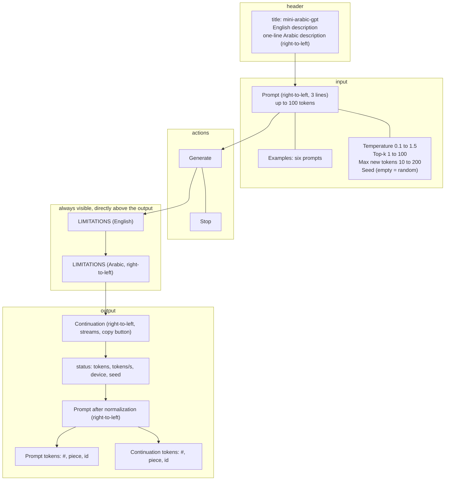
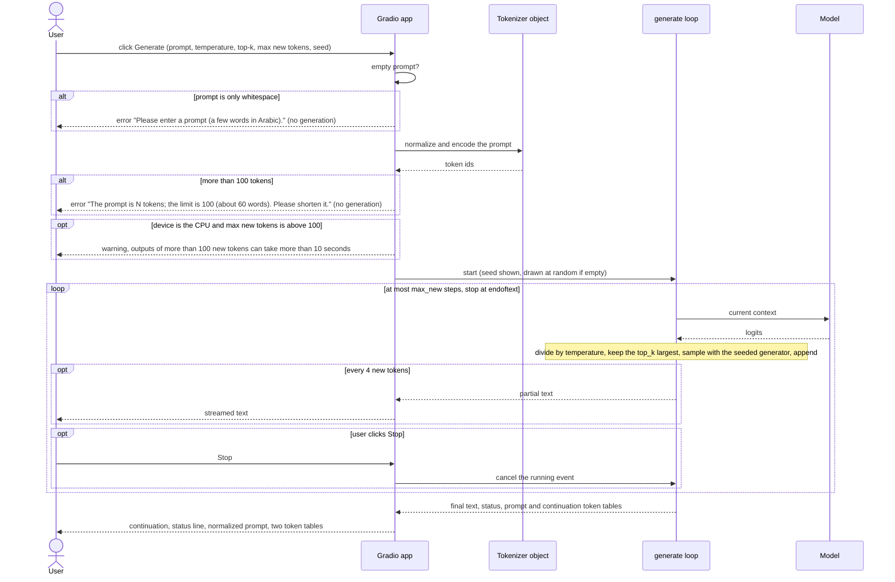

# UI Spec

| | |
|---|---|
| **Project** | mini-arabic-gpt |
| **Status** | Draft, pending ADR-0007 and ADR-0008 |
| **Version** | 0.1 |
| **Last updated** | 2026-10-10 |
| **Depends on** | `01-prd.md` (G5, FR7, FR8, M5, NG7, NG8), `02-design-doc.md` §4.6, §4.7, D7, `04-tokenizer-spec.md` (normalization shown in the demo), `05-model-architecture.md` (context length 512), `06-training-plan.md` (`model_final.pt`), `07-evaluation-plan.md` §5.2 (decoding), §5.1 (example prompts), §12, `08-testing-strategy.md` (`test_app.py`), `docs/adr/0002-tokenizer.md` |
| **Feeds** | `10-model-card.md` (limitations text, licence), `11-roadmap.md` (demo tasks, README recording) |

## 1. Purpose and scope

This document specifies the demo: a **local** Gradio application that runs on the project machine, lets a person type an Arabic prompt, shows the model's continuation as it is generated, shows how the text was tokenized, and always shows what the model cannot be trusted for. It also records, as an optional post-v1 step and not a deliverable, how the same app could be published on Hugging Face (§9). The Model Card has its own outline in `10-model-card.md`; the two documents share one limitations text (§5.3).

**Decision of the author (2026-10-10):** v1 is a local demo. A public host is not part of v1. The reason found while writing this document is in §2.

**Status of numbers.** The model, the tokenizer, and the app do not exist yet. Every measurement below comes from a throwaway prototype in the session scratchpad that runs the 16k pilot model of `06` §7 (16,967,424 parameters, the architecture of the final model) with a prototype of this interface on Gradio 6.30.0. They are labelled **preliminary (scratchpad, not the production pipeline)**. Commands and outputs are in Appendix A.

**Out of scope:** the model, the evaluation, the Model Card text, hosting on a public server.

## 2. Why the demo is local

The PRD (G5, M5, deliverable 5) and the Design Doc (§4.7, D7) assume a free public Space on Hugging Face running Gradio on CPU. The current Hugging Face documentation says otherwise:

- "Static Spaces are free for everyone. Gradio and Docker Spaces run on compute and require a paid plan to create: PRO for personal accounts, Team or Enterprise for organizations. Free personal accounts in good standing can still host up to 2 Gradio Spaces running on ZeroGPU" ([Spaces Overview](https://huggingface.co/docs/hub/spaces-overview), read 2026-10-09).
- The CPU Basic hardware (2 vCPU, 16 GB) "has no hourly cost, but creating a new Space that runs on compute (Gradio or Docker) requires a paid plan" ([Spaces GPU Upgrades](https://huggingface.co/docs/hub/spaces-gpus), read 2026-10-09).
- ZeroGPU: free personal accounts "in good standing (verified email, account older than 30 days) can host up to 2 ZeroGPU Spaces for free"; ZeroGPU Spaces are Gradio-only ([ZeroGPU](https://huggingface.co/docs/hub/spaces-zerogpu), read 2026-10-09).

The project has no budget for paid services (PRD §9), so a free Gradio-on-CPU Space is not available. The author chose to keep v1 local and to document ZeroGPU as an optional later step (§9). This changes PRD G5, M5, and deliverable 5 (§12). The unchecked assumption is recorded as EXP-008.

## 3. Requirements

| ID | Requirement | Source |
|---|---|---|
| UR1 | A Gradio app, `app/app.py`, runs locally with one documented command, serves on `127.0.0.1` only, and does not create a public link (`share=False`). | Author's decision; Design §4.7 |
| UR2 | The app accepts an Arabic prompt in a right-to-left field and shows the continuation, the prompt after normalization, and the tokenization of the prompt and of the continuation. | PRD FR8 |
| UR3 | The user can set temperature, top-k, maximum new tokens, and a seed. | PRD FR7 |
| UR4 | A prompt must not be empty and must not exceed 100 tokens; the maximum number of new tokens is 200. A violation gives a clear message and runs nothing. | Author's assumptions; §6 |
| UR5 | With the default settings and a prompt of up to 100 tokens, a continuation is complete in under 10 seconds on the project machine, and the first text appears in under 2 seconds. | PRD M5 as changed (§12); the first-text part is added by this document |
| UR6 | A limitations text is visible **directly above the output** at all times, in English and in Arabic. It is one text shared with the Model Card (§5.3). | Author's addition |
| UR7 | The app writes no prompt or output to disk, keeps no history, and does not send Gradio's usage telemetry. | PRD NG8; §7 |
| UR8 | The app uses the same tokenizer object and the same generate function as the evaluation (`07` §5.2) and shows the normalized prompt, so what the model saw is visible. | Design §4.7; `04` TR3 |
| UR9 | Generation streams, and a Stop button cancels it. | §5 |
| UR10 | Example buttons offer six of the approved hand-written prompts of `07` Appendix B. | Author's decision (Q3a) |
| UR11 | Labels are English; the prompt and output fields are right-to-left; a one-line Arabic description is present. | Author's decision (Q4a) |
| UR12 | The app uses CUDA when available and the CPU otherwise, with no code change, and shows the device. On the CPU, when max new tokens is above 100, it shows a warning that long outputs can take more than 10 seconds. | §6; author's decision (2026-10-10) |
| UR13 | The same prompt, settings, and seed give the same continuation on the same machine. | PRD NFR4 |
| UR14 | The README carries a short screen recording or GIF of the demo. | Author's decision |

## 4. Decisions at a glance

Status: **Decided** = decided with the author; **Provisional** = depends on a measurement or a later document named in §10.1.

| ID | Decision | Status | Evidence |
|---|---|---|---|
| U1 | Local Gradio app only for v1; publication on Hugging Face is optional and documented in §9 | Decided | §2 |
| U2 | Gradio `Blocks` interface; Gradio 6.30.0 pinned | Provisional | Appendix A.1 |
| U3 | Features: right-to-left prompt, sliders for temperature, top-k, and max new tokens, seed, examples, streaming, Stop, token view, normalized prompt, limitations text | Decided (Q3a) | §5 |
| U4 | English labels with right-to-left Arabic fields and an Arabic description | Decided (Q4a) | §5 |
| U5 | Defaults: temperature 0.8, top-k 40, max new tokens 80 (the evaluation settings of `07` §5.2); limits: prompt 100 tokens, new tokens 200 | Provisional | §6 |
| U6 | No KV cache in v1 | Decided (author's assumption), re-opened by §6 if needed | §6 |
| U7 | No content filter; the limitations text and the Model Card carry the warning | Decided (PRD NG8) | §7 |
| U8 | No prompt logging; telemetry explicitly disabled | Decided | §7 |
| U9 | The limitations text is one file, shown by the app and quoted by the Model Card | Decided | §5.3 |
| U10 | On the CPU, a warning is shown when max new tokens is above 100 | Decided (author, 2026-10-10) | §5.4, §6.2 |

## 5. Interface

### 5.1 Layout

```
+--------------------------------------------------------------------------+
| mini-arabic-gpt                                                           |
| A small GPT-style language model for Modern Standard Arabic, built from   |
| scratch in PyTorch.                         [Arabic one-line description] |
+------------------------------------------+-------------------------------+
| Prompt / البداية  (RTL, 3 lines)          | Temperature   0.1 .. 1.5      |
| "up to 100 tokens (about 60 words)"      | Top-k         1 .. 100        |
| Examples / أمثلة  (six prompts)           | Max new tokens 10 .. 200      |
|                                          | Seed (empty = random)         |
+------------------------------------------+-------------------------------+
| [ Generate / توليد ]  [ Stop ]                                            |
+--------------------------------------------------------------------------+
| LIMITATIONS (English)                                                     |
| LIMITATIONS (Arabic, right-to-left)                  <- always visible,   |
+--------------------------------------------------------------------------+
| Continuation / التكملة  (RTL, streams, copy button)                       |
| status: tokens, tokens/s, device, seed                                    |
| Prompt after normalization (RTL)                                          |
| [ Prompt tokens: #, piece, id ]        [ Continuation tokens: #, piece, id ] |
+--------------------------------------------------------------------------+
```



Diagram file: [11-interface-layout.md](diagrams/11-interface-layout.md)

### 5.2 Components

All argument names were checked against the installed Gradio 6.30.0 (Appendix A.1) and the [Gradio documentation](https://www.gradio.app/docs/gradio/blocks).

| Element | Gradio component and settings |
|---|---|
| Application | `gr.Blocks(title="mini-arabic-gpt", analytics_enabled=False)`; `.queue().launch(server_name="127.0.0.1", share=False, inbrowser=False, show_error=True)`. `server_name` defaults to `127.0.0.1` and the port search starts at 7860 (documentation) |
| Description | `gr.Markdown` for the English title and text; `gr.Markdown(..., rtl=True)` for the Arabic line (`rtl` is documented for `Markdown`) |
| Prompt | `gr.Textbox(lines=3, rtl=True, ...)` (`rtl` and `max_length` are documented for `Textbox`); the cap is enforced in tokens by the generate function, not in characters |
| Examples | `gr.Examples(examples=[...six prompts...], inputs=[prompt])`, with example caching off |
| Sliders | `gr.Slider` for temperature (0.1 to 1.5, step 0.05, default 0.8), top-k (1 to 100, step 1, default 40), max new tokens (10 to 200, step 5, default 80) |
| Seed | `gr.Number(precision=0)`; empty means random; the seed used is always shown |
| Buttons | Generate (primary) and Stop (cancels the running event) |
| Limitations | two `gr.Markdown` blocks (English, Arabic with `rtl=True`) placed immediately before the output textbox |
| Output | `gr.Textbox(lines=8, rtl=True, interactive=False)` with the copy button; filled by a generator, so it streams ([Gradio streaming guide](https://www.gradio.app/guides/streaming-outputs)) |
| Status | `gr.Markdown`: new tokens, tokens per second, device, seed |
| CPU warning | `gr.Warning(...)` at the start of a run when the device is the CPU and max new tokens is above 100 |
| Normalized prompt | `gr.Textbox(rtl=True, interactive=False)` |
| Token view | two `gr.Dataframe(headers=["#", "piece", "id"], interactive=False)`, one for the prompt and one for the continuation |

### 5.3 The limitations text (shared with the Model Card)

One file, `app/limitations.md`, in English and Arabic. The app displays it; `10-model-card.md` quotes it verbatim; a test checks both (§8). Draft (the Arabic is a draft pending native-speaker review, task 1 of §10.3):

> **Please read before using the output.** This is a small research model (about 17M parameters) trained only on Arabic Wikipedia text. It **continues text; it does not answer questions**. Its output may be false, repetitive, ungrammatical, or offensive, and it cannot write diacritics. Do not rely on it for facts, advice, or decisions.
>
> نموذج بحثي صغير مدرَّب على ويكيبيديا العربية فقط؛ يكمل النص ولا يجيب عن الأسئلة، وقد يكون ناتجه خاطئًا أو مكررًا أو غير سليم لغويًا أو مسيئًا. لا تعتمد عليه.

The parameter count in the text is read from the model's config when the app starts, so it cannot drift from the model.

### 5.4 Messages

| Situation | Message (English; shown as an error) | Runs generation |
|---|---|---|
| Empty prompt (only whitespace) | "Please enter a prompt (a few words in Arabic)." | no |
| More than 100 tokens | "The prompt is N tokens; the limit is 100 (about 60 words). Please shorten it." | no |
| Model or tokenizer file missing at start | the app exits with the path it looked for and the command that creates it | not started |
| Any other exception during generation | "Generation failed: <short reason>"; the details go to the console, not to the page | stops |
| Device is the CPU and max new tokens is above 100 | Warning (a notification, not an error): "Running on the CPU: outputs of more than 100 new tokens can take more than 10 seconds." Shown with `gr.Warning` when the run starts; the run proceeds | yes |

Both prompt messages were produced by the prototype through the API as errors with exactly these texts (Appendix A.2). `gr.Warning(message, duration, visible, title)` exists in Gradio 6.30.0 (checked by introspection); the warning of the last row was not exercised in the prototype.

### 5.5 What the token view shows

The prompt tokens are those of the normalized prompt (what the model actually receives), the continuation tokens are the generated ids. A piece is the token's bytes decoded as UTF-8; a piece that is only part of a character (byte-level BPE can split one) is shown as its bytes in hexadecimal, for example `<bytes d8>`, never as a replacement character. Special tokens are not listed; the continuation ends silently at `<|endoftext|>`.

## 6. Behaviour and performance

### 6.1 Generation

1. The prompt goes through the tokenizer object, which normalizes it (`04` §4) and encodes it. More than 100 tokens, or none, is rejected (§5.4).
2. Loop for at most `max_new` steps: run the model on the current context, divide the logits by the temperature, keep the `top_k` largest, sample with the seeded generator, append, stop at `<|endoftext|>`. This is the decoding of `07` §5.2.
3. The context never exceeds 100 + 200 = 300 tokens, below the context length of 512, so the sliding window of Design §4.6 is never needed; the app asserts it.
4. The text is yielded every 4 new tokens and once more at the end with the status and the two token tables.
5. The seed is an integer; if empty, one is drawn at random once and shown, so a run can be repeated.



Diagram file: [12-request-flow.md](diagrams/12-request-flow.md)

### 6.2 Latency (measured on the prototype)

Seconds to generate the continuation with the 16.97M-parameter pilot model, temperature 0.8, top-k 40, **without** KV cache (the v1 design) and with a KV cache for comparison. "CPU 2" restricts PyTorch to 2 threads, the size of the free Hugging Face CPU tier; this laptop's cores are probably faster than that tier's, which was not measured.

| Device | Prompt 13, 80 new | **Prompt 100, 80 new (default)** | Prompt 100, 200 new |
|---|---|---|---|
| GPU (RTX 5050), no cache | 0.67 | **0.74** | 1.51 |
| CPU, 8 threads, no cache | 2.00 | **3.45** | 10.46 |
| CPU, 2 threads, no cache | 2.76 | **5.23** | 17.53 |
| GPU, KV cache | 0.66 | 0.60 | 1.64 |
| CPU 8, KV cache | 1.03 | 1.18 | 2.68 |
| CPU 2, KV cache | 0.90 | 0.90 | 2.20 |

- **UR5 holds** at the default settings on every device tested: 0.74 s on the GPU, which the app uses on the project machine, and 5.2 s on 2 CPU threads. Through Gradio on the GPU, the first text appeared after 0.97 s and 80 tokens were complete after 1.9 s (Appendix A.2).
- **Long outputs on a CPU break the 10 s target without a cache:** 200 new tokens take 17.5 s on 2 threads and 10.5 s on 8. Without a cache, the cost of a token grows with the context (about 21 ms at 13 tokens of context and about 210 ms at 413 on 2 threads).
- **A KV cache fixes it** (4 to 8 times faster at 200 new tokens on a CPU: 10.46 to 2.68 s on 8 threads, 17.53 to 2.20 s on 2 threads; no gain on the GPU) and gives the same logits: maximum absolute difference 1.3e-5 in `float32` between the cached and the full forward pass over 120 tokens. It is about 25 lines and one more place for a silent bug (a test and an injection would be needed).
- **Decision U6 (v1 without a cache) stands** because the project machine has a GPU, UR5 is defined for the default settings, and the status line shows the speed. The cache is the first thing to add if the demo is ever run on a CPU with long outputs, or if the default length is raised. Until then, on a CPU the app warns when max new tokens is above 100 (U10).
- Start-up (import of PyTorch and Gradio, load of the model) took 10.1 s cold; building the interface 0.2 s; the model occupies 67 MiB of GPU memory. The model file is 67.9 MB (`float32`).

### 6.3 Concurrency

The demo is for one person on one machine. Gradio's queue serializes generation; no concurrency feature is specified.

## 7. Privacy and safety

- **Local only.** The server binds `127.0.0.1` (the documented default) and `share=False`; no public URL is created. Binding was confirmed in the prototype (Appendix A.2).
- **No logging.** The app writes nothing to disk. Example caching is off.
- **Telemetry.** The Gradio documentation says `analytics_enabled` is "Whether to allow basic telemetry. If None, will use GRADIO_ANALYTICS_ENABLED environment variable or default to True": **the default is on**, so the app sets `analytics_enabled=False` explicitly (UR7) and a test checks it. Other network calls that Gradio may make at start-up were not audited.
- **No content filter** (PRD NG8, U7). The model may produce offensive text; the limitations text above the output says so, and the Model Card describes the probe results in one line each (`07` §5.6). If the demo is ever published, the host's own logging is outside this document's control (§9).

## 8. Tests

The demo's tests are in `test_app.py` of `08-testing-strategy.md`. That document lists three (smoke, parity of tokenizer and generate, latency). This document needs 14 more (the 13 approved on 2026-10-10 plus the CPU-warning test that follows from the author's decision); they are proposed additions (§12, item 14). Items marked "prototyped" were exercised on the prototype with the results of Appendix A.2.

| Test | Requirement | Prototyped |
|---|---|---|
| `test_demo_binds_to_loopback_only` | UR1 | yes (listening check) |
| `test_demo_analytics_disabled` | UR7 | no |
| `test_empty_prompt_rejected_with_message` | UR4 | yes |
| `test_prompt_of_101_tokens_rejected_100_accepted` | UR4 | partly (151 rejected, 20 accepted) |
| `test_limitations_text_is_shown_directly_above_the_output` (the layout order) | UR6 | no |
| `test_limitations_file_text_equals_the_model_card_quote` | UR6 | no |
| `test_prompt_and_output_fields_are_rtl` | UR11 | no |
| `test_same_seed_same_output_through_the_app` | UR13 | yes |
| `test_streaming_yields_partial_text_before_completion` | UR9 | yes (22 updates for 80 tokens) |
| `test_token_view_matches_the_tokenizer` | UR2, UR8 | no |
| `test_no_files_written_during_generation` | UR7 | no |
| `test_device_is_cuda_when_available_else_cpu` | UR12 | no |
| `test_cpu_warning_shown_above_100_new_tokens` | UR12 | no |
| `test_default_settings_complete_under_10_s_for_a_100_token_prompt` | UR5 | yes (latency table) |

Two new injections are proposed for the catalog of `08` §6 (§12, item 15): the limitations text removed or moved below the output, and the telemetry flag left at its default.

## 9. Optional post-v1 publication (not a deliverable)

Documented so that the step can be taken later without new research. None of it is part of v1.

| Item | Detail (from the Hugging Face documentation read on 2026-10-09 unless noted) |
|---|---|
| Free route | A Gradio Space on **ZeroGPU**. Needs a **personal** Hugging Face account in good standing (verified email, **older than 30 days**); free accounts can host up to 2 ZeroGPU Spaces. Organization accounts need a paid plan |
| Paid route | PRO for a Gradio Space on any hardware, including CPU Basic |
| Code changes | Add the `spaces` package; decorate the function that runs the model with `@spaces.GPU`; place the model on `cuda` at module level (the documentation says lazy placement inside the decorated function is discouraged); the SDK must be Gradio, version 4 or later |
| Versions listed | PyTorch 2.8.0 to 2.13.0, Python 3.12.12 or 3.10.13 on the page read; the project machine runs PyTorch 2.14.1, so the Space's `requirements.txt` would pin a listed version and the model code (plain PyTorch) re-checked on it |
| Model files | A model repository on the Hub with `model.safetensors`, `config.json`, `tokenizer.json`, `tokenizer_config.yaml`, and `README.md` (the Model Card); the safetensors format avoids pickle ([Safetensors](https://huggingface.co/docs/safetensors/index): "storing tensors safely (as opposed to pickle)"). The app would load them with `huggingface_hub` instead of local paths (an optional argument) |
| Licence and attribution | ADR-0008; the attribution text of `10-model-card.md` §6 must travel with the weights |
| Not guaranteed | Visitors' GPU quota; the host's logs of prompts (UR7 cannot be promised there); continued availability of the free route |
| Not planned | A static Space with in-browser inference: free, but needs the tokenizer ported to JavaScript and breaks UR8 |

A public Space also needs a decision on where prompts may be logged and on the abuse of an unfiltered model; this must be revisited before publication.

## 10. Provisional decisions, open questions, and tasks

### 10.1 Provisional decisions and how each is confirmed

| Decision | Confirmed or changed by |
|---|---|
| Gradio 6.30.0 and the component settings (U2) | The production app; Gradio changes between major versions (the prototype found that `theme` and `css` moved to `launch()` in 6.30) |
| Defaults and limits (U5) | The final model's latency and a look at outputs on the development prompts (`07` §5.2) |
| No KV cache (U6) | The latency test on the final model; add the cache if the 10 s target fails or long outputs matter |
| Limitations text wording | Both authors; the Arabic by a native speaker |

### 10.2 Open questions

| # | Question | Resolved in |
|---|---|---|
| 1 | ~~Should the CPU fallback warn about speed when max new tokens is above 100?~~ **Decided: yes** (U10, UR12) | Done |

### 10.3 Tasks for `11-roadmap.md`

| # | Task | Must be done before |
|---|---|---|
| 1 | Native-speaker review of the Arabic texts of the demo (description, limitations, labels) | the app is merged |
| 2 | Approve the six example prompts (the same approval as `07` Appendix B) | the app is merged |
| 3 | Write `app/app.py` and `app/limitations.md` test-first (`08`), after the final model exists | the main run is evaluated |
| 4 | Pin `gradio==6.30.0` in `requirements-dev.txt` | the app is merged |
| 5 | Record a short screen recording or GIF of the local demo for the README | the project is presented |
| 6 | Optional: publish the weights on the Hub (model repository only) and, if wanted, a ZeroGPU Space, following §9 and ADR-0008 | only after v1 |

## 11. Alternatives considered

| Alternative | Outcome | Why |
|---|---|---|
| Gradio on a free Hugging Face CPU Space | Not available | Creating a Gradio Space needs a paid plan (§2) |
| Gradio on ZeroGPU | Optional, post-v1 | Free, but needs an eligible account, a code change, and cannot guarantee UR7 |
| Gradio `share=True` public link | Rejected | It exposes the local machine and the prompts to the internet |
| Paid Hugging Face PRO | Rejected | Violates PRD §9 (no paid services) |
| Static Space with in-browser inference | Not planned | Large extra work; breaks UR8 |
| Streamlit, or a custom React and FastAPI front end | Rejected | Design D7 and PRD NG7 |
| Command-line interface only | Rejected | Does not meet FR8's display of the tokenization for a general audience |

## 12. Proposed edits to earlier documents

*Part D (2026-10-10): every row below has a status in the last column; "Applied" refers to the row identifiers of the Part D table (PD-nn), "Left to the author" rows are edits to `CLAUDE.md`.*

Before Part D: not applied; listed for Part D.

| # | Document | Old | New | Part D status |
|---|---|---|---|---|
| 1 | `01-prd.md` G5 | "Deploy a public interactive demo that anyone can use without installing anything." | "Provide an interactive demo (Gradio) that runs locally on the project machine. Publishing it publicly is an optional step after v1 (`09-ui-spec.md` §9)." | Applied (PD-03) |
| 2 | `01-prd.md` M5 | "Demo availability / Publicly accessible demo that returns a continuation in under 10 seconds *(provisional)*" | "Demo responsiveness / The local demo returns a continuation in under 10 seconds for prompts up to 100 tokens on the project machine" (the author's wording; default settings, `09` §6.2) | Applied (PD-08) |
| 3 | `01-prd.md` §8, deliverable 5 | "**Live demo** on Hugging Face Spaces (Gradio)." | "**Local demo** (Gradio), with a short screen recording or GIF in the README. Publishing on Hugging Face Spaces is optional." | Applied (PD-11) |
| 4 | `01-prd.md` §8, deliverable 4 | "**Trained model checkpoint**, published on the Hugging Face Hub." | "**Trained model checkpoint**. Publishing it on the Hugging Face Hub (model repository only, no Space) is optional." | Applied (PD-10) |
| 5 | `01-prd.md` §1, summary | "…evaluation, and deployment as a public demo." | "…evaluation, and a local demo." | Applied (PD-02) |
| 6 | `01-prd.md` §5, audience row for hiring managers | "A clear README, a working demo link, readable docs, and evidence of sound engineering judgment." | "A clear README with a screen recording of the demo, readable docs, and evidence of sound engineering judgment." | Applied (PD-04) |
| 7 | `01-prd.md` §11, row "Demo hosting details and response-time target" | listed as open, resolved in `09-ui-spec.md` | resolved: local demo; response-time target in M5 | Applied (PD-14) |
| 8 | `02-design-doc.md` D7 | "Gradio demo on Hugging Face Spaces (CPU)" with "free hosting" as a reason | "Gradio demo, run locally; Hugging Face Spaces (ZeroGPU) optional after v1". Reason: Gradio Spaces need a paid plan except ZeroGPU (`09` §2) | Applied (PD-28) |
| 9 | `02-design-doc.md` §4.7, Design bullets | "Hosted on Hugging Face Spaces, on **CPU** (free tier). A 10M–30M parameter model runs acceptably on CPU." and "The model checkpoint and tokenizer are downloaded from the Hugging Face Hub when the app starts, not stored in the Git repository." | "Runs locally on the project machine (GPU if present, CPU otherwise; `09` §6.2 gives measured latencies). The model and tokenizer are read from local paths; an optional argument loads them from the Hub." | Applied (PD-29) |
| 10 | `02-design-doc.md` §2, flow diagram line "G -->\|6. Demo\| H[Gradio app<br/>Hugging Face Spaces]" | "Hugging Face Spaces" | "local" | Applied (PD-30) |
| 11 | `02-design-doc.md` §5, artifacts row "Final model" | location "Hugging Face Hub" | "`checkpoints/<run>/model_final.pt` (local); Hub optional" | Applied (PD-31) |
| 12 | `README.md` | no demo section | a short section with the launch command and the screen recording or GIF (task 5) | Applied (PD-62) |
| 13 | `CLAUDE.md` line 7 (flagged, not for me to edit) | "It ships with a Gradio demo on Hugging Face Spaces." | "It ships with a local Gradio demo; publishing on Hugging Face is optional." | Left to the author (CL-1); the author applies it in `CLAUDE.md` |
| 14 | `08-testing-strategy.md` §5.4 and §5.3 | three demo tests; M5 test "on CPU under 10 seconds" | add the 14 tests of §8 above (the 13 approved by the author on 2026-10-10 for Part D, plus the CPU-warning test); change the M5 test to "default settings, 100-token prompt, on the project machine"; map UR1 to UR14 | Applied (PD-57) |
| 15 | `08-testing-strategy.md` §6.5 (injection catalog) | 16 injections | add I-17 "limitations text removed or placed below the output" (test `test_limitations_text_is_shown_directly_above_the_output`) and I-18 "analytics left at the default" (test `test_demo_analytics_disabled`). **Approved by the author on 2026-10-10 for Part D** | Applied (PD-58) |
| 16 | `requirements-dev.txt` (outside this task's allowed edits) | no gradio | add `gradio==6.30.0` | Applied (PD-64) |
| 17 | `01-prd.md` M6 and `02-design-doc.md` §3 (diagram count) | "14 diagrams" | running list: 3 + 3 + 2 + 2 + 2 (this document) = 12 | Superseded by PD-09 (final total 14 diagrams) |

## 13. Diagrams this document needs

| Diagram | What it must show |
|---|---|
| Interface layout | The wireframe of §5.1 with the limitations text directly above the output and the right-to-left fields marked |
| Request flow | Generate click → validation (empty, over 100 tokens) → normalization and encoding → generation loop (temperature, top-k, sample, stop) → streamed text → final status and token tables; Stop cancelling the loop |

## 14. Related documents

- `01-prd.md`: G5, FR7, FR8, M5, NG7, NG8
- `02-design-doc.md` §4.6, §4.7, D7
- `04-tokenizer-spec.md`: normalization shown in the demo
- `05-model-architecture.md`: context length, parameter count
- `06-training-plan.md`: the checkpoint the demo loads
- `07-evaluation-plan.md` §5.1, §5.2, §5.6: example prompts, decoding, probes
- `08-testing-strategy.md`: `test_app.py`
- `docs/adr/0007-demo.md`: local Gradio demo, optional publication (proposed)
- `docs/adr/0008-model-licence.md`: licence of the published weights (proposed)
- `10-model-card.md`: outline of the Model Card

## 15. References

- Gradio 6.30.0: [Blocks](https://www.gradio.app/docs/gradio/blocks) (`analytics_enabled`, `server_name`), [Textbox](https://www.gradio.app/docs/gradio/textbox) and [Markdown](https://www.gradio.app/docs/gradio/markdown) (`rtl`), [Examples](https://www.gradio.app/docs/gradio/examples), [streaming outputs](https://www.gradio.app/guides/streaming-outputs)
- Hugging Face Hub: [Spaces Overview](https://huggingface.co/docs/hub/spaces-overview), [Spaces GPU Upgrades](https://huggingface.co/docs/hub/spaces-gpus), [ZeroGPU](https://huggingface.co/docs/hub/spaces-zerogpu), [Safetensors](https://huggingface.co/docs/safetensors/index)
- Pages read on 2026-10-09 (Spaces, ZeroGPU, Textbox `rtl`) and 2026-10-10 (the others).

## Appendix A. Measurement log

Scripts are throwaway files in the session scratchpad (`pilot/`), not in the repository. Environment: Windows 11, Python 3.12.10, PyTorch 2.14.1+cu130, Gradio 6.30.0 and `gradio_client` 2.7.2 installed in the virtual environment only (a dry run showed 34 new packages and no change to numpy, torch, huggingface_hub, pyarrow, or tokenizers). **Everything is preliminary (scratchpad, not the production pipeline).**

### A.1 Gradio 6.30.0 API facts used

```
gr.Blocks.__init__:  analytics_enabled, mode, title, fill_height, fill_width, delete_cache, kwargs        (no theme/css here)
gr.Blocks.launch:    ... share, show_error, server_name, server_port, quiet, footer_links, ..., theme, css, css_paths, js, head ...
gr.Textbox:          ... rtl, buttons, max_length, submit_btn, stop_btn ...        gr.Markdown: rtl documented
gr.Slider(minimum, maximum, value, step, ...)     gr.Number(value, precision, ...)     gr.Dataframe(headers, interactive, max_height, ...)
PyPI: gradio 6.30.0, requires_python >=3.10
```

### A.2 Prototype app, called through `gradio_client`

`app_proto.py` (the interface of §5) launched on `127.0.0.1:7861`; `app_proto_test.py` and `app_proto_err.py` call `/generate`:

```
device cuda | listening on 127.0.0.1: True | one API endpoint: /generate
prompt of 13 tokens, 80 new:  first output after 0.97 s, complete after 1.92 s, 22 streamed updates, "done: 80 new tokens in 1.4 s (56.3 tokens/s), device cuda, seed 1"
                              prompt-token rows 13, continuation-token rows 80, normalized prompt shown
prompt of 13 tokens, 200 new: first output 0.97 s, complete 2.79 s ("done: 167 new tokens ..."; the model emitted <|endoftext|> at 167)
same prompt, same seed, twice: identical output (True)
empty prompt:            AppError: Please enter a prompt (a few words in Arabic).
prompt of 151 tokens:    AppError: The prompt is 151 tokens; the limit is 100 (about 60 words). Please shorten it.
prompt of about 20 tokens: runs
start-up: import + model load 10.1 s (cold); interface built in 0.22 s; GPU memory 67 MiB
```

### A.3 Latency and KV cache

`demo_latency.py`: pilot model (16,967,424 parameters), temperature 0.8, top-k 40, prompts of 13 and 100 tokens; times in seconds in the table of §6.2; equality check:

```
kv_cache_vs_full_max_abs_logit_diff: 1.2874603271484375e-05   (float32, 120 tokens, CPU)
```

An earlier run of the no-cache CPU case (`cpu_latency.py`) gave 2.98 s for 13 + 80 tokens on 2 threads, 11.98 s for 13 + 200, and 16.86 s for 80 new tokens after 400 tokens of context (about 210 ms per token).
