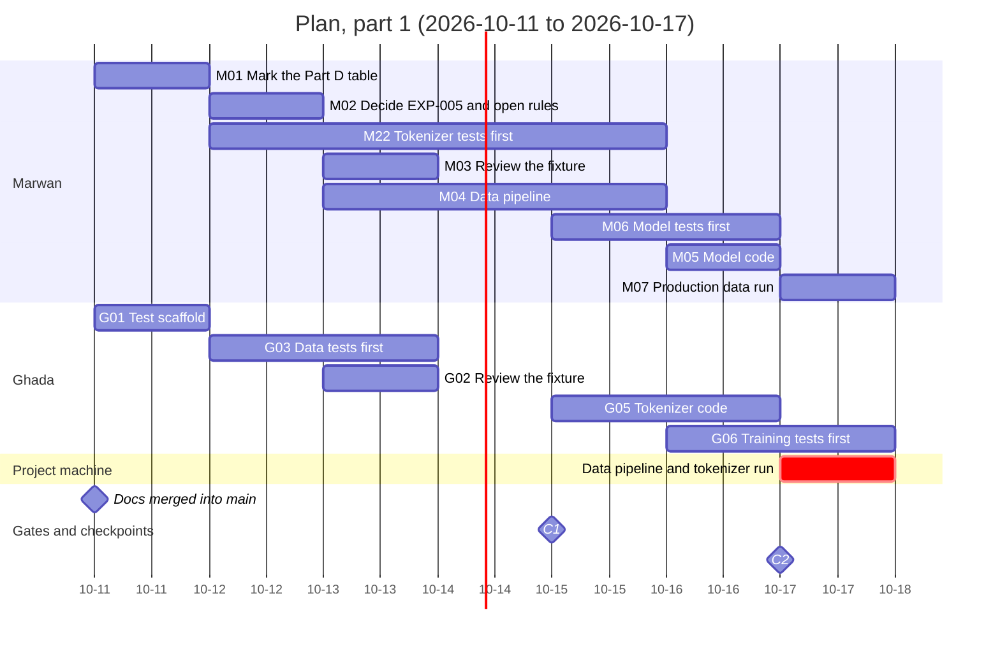
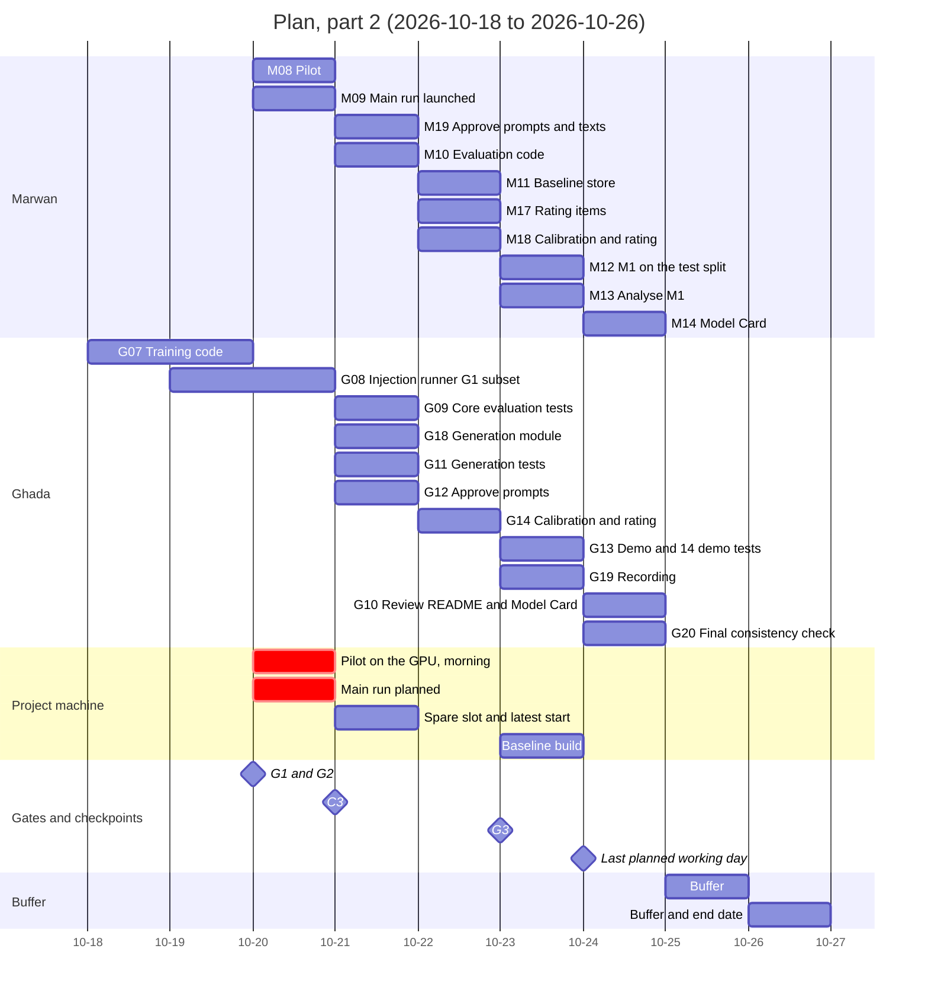
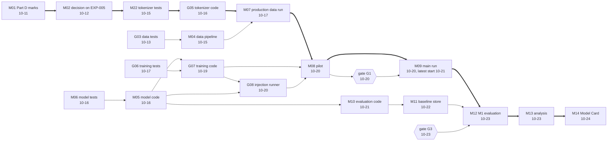

# Roadmap

| | |
|---|---|
| **Project** | mini-arabic-gpt |
| **Status** | Draft, pending ADR-0009 |
| **Version** | 0.1 |
| **Last updated** | 2026-10-10 |
| **Depends on** | `01-prd.md` (§9 constraints, M1 to M6, §10 risks), `02-design-doc.md`, `03-data-spec.md` to `10-model-card.md` (especially the task lists of `07` §12, `08` §11, `09` §10.3, `10` §7, and the gates G1 to G3 of `08` §5.2), `docs/adr/0001-training-corpus.md` to `docs/adr/0008-model-licence.md`, `experiments/experiment-log.md` |
| **Feeds** | the implementation phase (the daily plan), the final consistency review (Part D) |

## 1. Purpose and scope

This document turns the specifications into a dated plan: who does what, in which order, on which machine, how many hours it is expected to take, what must pass before the next step, what is cut first if time runs short, and what can go wrong. It covers 2026-10-11 to 2026-10-26, the end date after the move of §2.1.

It makes no technical decision of its own. Every technical choice is in documents 03 to 10; this document only places them on the calendar.

**Terms (added in Part D).** "Scratchpad pilot" means a throwaway experiment run in the session scratchpad before the production code exists: the vocabulary pilot of `06` §7 and the pilot model of `07`. "Production pilot" means the first run of the production code before the main run (`06` §6, gates P-a to P-d). In this document, "the pilot" means the production pilot.

**Status of numbers.** The machine times are measured or computed in earlier documents (cited). The **hour estimates are Claude's**, for hand-written work by the person named, and were not measured: no production code exists yet. The size of the prototypes (60 to 180 lines for a model, a training loop, a baseline, or a demo) is the only anchor. Treat each estimate as plus or minus 50%. They are provisional and are re-checked at the checkpoints of §8.

## 2. Inputs

| Input | Value | Source |
|---|---|---|
| Today | Saturday 2026-10-10 (docs phase ends; Part D starts) | |
| Planning window | 14 planned days, Sunday 2026-10-11 to Saturday 2026-10-24; Sunday 2026-10-25 and Monday 2026-10-26 are unplanned buffer days; 2026-10-26 is the end date (moved from 2026-10-23, §2.1) | author (lever D, 2026-10-10) |
| Docs phase | 9 days (2026-10-02 to 2026-10-10) against the 4 to 5 days of the PRD mitigation | `01-prd.md` §10 |
| Capacity, Marwan | 4 hours per day, 2 days off | author |
| Capacity, Ghada | 4 hours per day, 2 days off | author |
| External deadline | none before the end date | author |
| Days off | not named; the arithmetic spreads them evenly (accepted by the author, 2026-10-10) | author |
| Planning factor | 80% of stated hours (20% reserve for what goes wrong) | assumption |
| Machines | all GPU work and all jobs on `data/` (pilot, main and spare runs, baseline build, evaluation, data pipeline, tokenizer training) run on the project machine and are operated by Marwan; Ghada works from her own machine on CPU-only parts (tokenizer code and tests, the test suite, the demo) and pushes her own commits | author |
| Roles | Marwan: data, model architecture, evaluation, generation; Ghada: tokenizer, training, testing, demo | README, author |
| Part D | one table of every proposed edit; the author marks each row approve or reject; Claude applies the approved rows in one commit; `CLAUDE.md` rows are left to the author | author |

Capacity arithmetic: 14 planned days, 12 working days each (2 days off, spread evenly, assumed to fall inside the window), so each person works 12/14 = 0.857 of the planned days; 4 hours × 0.8 × 0.857 = **2.74 planned hours per person per calendar day**. Raw (stated) capacity is 2 × 4 × 12 = **96 hours**; planned capacity is **76.8 hours**. The two buffer days add nothing: they are kept free.

### 2.1 The end date moved from 2026-10-23 to 2026-10-26

- **Original target:** 2026-10-23 (PRD §9: three weeks from 2026-10-02).
- **Reason:** the documentation phase overran (the PRD's mitigation said 4 to 5 days; it took 9, from 2026-10-02 to 2026-10-10), and the main run must not be rushed. The overrun was caught by the hour arithmetic of §5: with 12 planned days to 2026-10-22, the Level 1 and Level 2 tasks needed 124% of the planned hours and 99% of the stated ones, and the stretch to the main run needed 104% of the planned hours. It is recorded as EXP-009.
- **Decision (the author, 2026-10-10):** lever D of the first version of this plan: the end date moves to **2026-10-26**; 2026-10-25 and 2026-10-26 are buffer days; **M2 and the local demo stay in scope**.
- **Effect:** the planned window grows from 12 to 14 days and the shortfall of 15.3 planned hours (first plan) closes to 2.5 hours (§5.2).

## 3. Requirements

| ID | Requirement | Source |
|---|---|---|
| RM1 | The main run is planned to start on 2026-10-20 and must start by 2026-10-21, and only after gate G1 has passed. G1 is never waived. The rule accepted with the old end date was "by 2026-10-18"; the same lead before the end date gives 2026-10-21, **confirmed by the author on 2026-10-10** (§12.2, question 5). | Author (Q4); `08` §5.2 |
| RM2 | 2026-10-24 is the last planned working day (the Model Card and the final check only); 2026-10-25 and 2026-10-26 are buffer days; 2026-10-26 is the end date and the submission day. | Author (Q4 and lever D) |
| RM3 | Tier A is never cut. If time runs short, cut in this order: Tier C, then demo polish, then the injections beyond the G1 subset. | Author (Q2) |
| RM4 | Gates G1, G2, and G3 of `08` §5.2 are passed in order; the test split is read once, after G3. | `07` §7, `08` |
| RM5 | Test-first: no component is merged without its tests passing. A component's tests are written by someone other than its author where the load allows (§7.2). | `08` TS2 |
| RM6 | Every task promised by documents 07, 08, 09, and 10 appears in §11, scheduled or explicitly deferred. | this document |
| RM7 | GPU and RAM-heavy jobs do not overlap on the project machine (§7.4). | §7.4 |
| RM8 | At each checkpoint (§8) the hours actually used are compared with the plan, and the cut order is applied when a trigger is met. | §8 |

## 4. Decisions at a glance

Status: **Decided** = decided with the author (planning questions Q1 to Q5); **Provisional** = depends on hours worked and on measurements named in §12.

| ID | Decision | Status | Evidence |
|---|---|---|---|
| P1 | Capacity: 4 hours a day each, 2 days off each, planned at 80%, over 12 planned days | Decided (Q1); factor provisional | §2 |
| P2 | Tiers A, B, C and the cut order | Decided (Q2) | §6 |
| P3 | Roles as in the README; project-machine jobs operated by Marwan; Ghada on CPU-only parts from her own machine | Decided (Q3) | §2 |
| P4 | Schedule backbone stretched to 14 planned days; buffer days 10-25 and 10-26; planned main run on 2026-10-20, latest 2026-10-21 | Decided (lever D; dates confirmed by the author, 2026-10-10) | §7.1 |
| P5 | Part D: one edits table, the author marks rows, Claude applies the approved rows in one commit, `CLAUDE.md` rows left to the author | Decided (Q5) | §7.1 |
| P6 | Cross-writing of tests where it balances the load and keeps the tests independent: Marwan writes the tokenizer tests (the code is Ghada's); Ghada writes the data tests and the core evaluation tests (the code is Marwan's). The model tests (Marwan), the training tests (Ghada), and the generation tests (Ghada) are written by the code's own author, a known weakness covered by the injections of `08` §6 | Provisional (needs the author's confirmation) | §7.2 |
| P7 | Level 1 (Tier A) and Level 2 (M2 and the demo) are both scheduled; Level 3 is not scheduled | Provisional | §5 |
| P8 | Code is developed on short-lived branches from `main`, one pull request per component, merged only with its tests passing; each person pushes her or his own commits | Provisional | §7.6 |
| P9 | Checkpoints C1 (10-15), C2 (10-17), and C3 (10-21) with the triggers of §8 | Decided | §8 |
| P10 | End date moved to 2026-10-26 (lever D); M2 and the local demo stay in scope; lever E (Claude Code drafting) is not assumed, and time it frees goes to Level 3 in the reverse of the cut order | Decided (author, 2026-10-10) | §2.1, §9 |

## 5. Capacity and demand

### 5.1 Capacity by date

Planned hours available to each person, cumulative from 2026-10-11 (2.74 per calendar day; the buffer days add none):

| Date | Day | Planned hours, each person (cumulative) | Planned hours, both |
|---|---|---|---|
| 10-11 | Sun | 2.7 | 5.5 |
| 10-12 | Mon | 5.5 | 11.0 |
| 10-13 | Tue | 8.2 | 16.5 |
| 10-14 | Wed | 11.0 | 21.9 |
| 10-15 | Thu | 13.7 | 27.4 |
| 10-16 | Fri | 16.5 | 32.9 |
| 10-17 | Sat | 19.2 | 38.4 |
| 10-18 | Sun | 21.9 | 43.9 |
| 10-19 | Mon | 24.7 | 49.4 |
| 10-20 | Tue | 27.4 | 54.9 |
| 10-21 | Wed | 30.2 | 60.3 |
| 10-22 | Thu | 32.9 | 65.8 |
| 10-23 | Fri | 35.7 | 71.3 |
| 10-24 | Sat | 38.4 | 76.8 |
| 10-25 (buffer, not planned) | Sun | 38.4 | 76.8 |
| 10-26 (buffer, not planned) | Mon | 38.4 | 76.8 |

### 5.2 Demand by level

Levels group the tasks of §7 by priority (the tiers of §6). Level 1 is Tier A. Level 2 is the M2 human rating and the local demo (Tier B). Level 3 is the rest (Tier B and C), not scheduled.

| Scope | Marwan (h) | Ghada (h) | Total (h) | % of planned 76.8 h | % of raw 96 h |
|---|---|---|---|---|---|
| Level 1 (Tier A) | 36.0 | 26.8 | 62.8 | 82% | 65% |
| Level 2 (M2 rating and demo) | 3.5 | 13.0 | 16.5 | 21% | 17% |
| **Level 1 and 2 (the plan)** | **39.5** | **39.8** | **79.3** | **103%** | **83%** |
| Level 3 (Tier B and C, unscheduled) | 3.5 | 5.5 | 9.0 | 12% | 9% |
| All levels | 43.0 | 45.3 | 88.3 | 115% | 92% |

**The finding.** With the end date moved to 2026-10-26, Level 1 uses 82% of the planned hours (62.8 of 76.8). Levels 1 and 2 together need 79.3 hours: 103% of the planned 76.8 and 83% of the stated 96, a reserve of about 17% instead of 20%. PRD success metrics M2 (human rating) and M5 (demo) are in Level 2 and are kept. With Level 3 the demand (88.3 hours) is 115% of the planned hours and 92% of the stated ones, so Level 3 is not scheduled. On the first plan (12 planned days to 2026-10-22) Levels 1 and 2 needed 124% of the planned hours; that is what moved the end date (§2.1).

### 5.3 Cumulative demand against capacity

Planned hours due by the end of each day (each task counted on its due date), against the planned capacity. A negative slack means the plan needs more than 80% of the stated hours by that date.

| Date | Capacity (each) | Marwan, Level 1 | Marwan, 1 + 2 | Ghada, Level 1 | Ghada, 1 + 2 | Both, 1 + 2 | Capacity (both) | Slack (both) |
|---|---|---|---|---|---|---|---|---|
| 10-11 | 2.7 | 2.0 | 2.0 | 0.8 | 0.8 | 2.8 | 5.5 | +2.7 |
| 10-12 | 5.5 | 2.5 | 2.5 | 0.8 | 0.8 | 3.3 | 11.0 | +7.7 |
| 10-13 | 8.2 | 3.0 | 3.0 | 4.8 | 4.8 | 7.8 | 16.5 | +8.7 |
| 10-14 | 11.0 | 3.0 | 3.0 | 4.8 | 4.8 | 7.8 | 21.9 | +14.1 |
| 10-15 | 13.7 | 12.5 | 12.5 | 4.8 | 4.8 | 17.3 | 27.4 | +10.1 |
| 10-16 | 16.5 | 17.0 | 17.0 | 9.3 | 9.3 | 26.3 | 32.9 | +6.6 |
| 10-17 | 19.2 | 19.5 | 19.5 | 12.8 | 12.8 | 32.3 | 38.4 | +6.1 |
| 10-18 | 21.9 | 19.5 | 19.5 | 12.8 | 12.8 | 32.3 | 43.9 | +11.6 |
| 10-19 | 24.7 | 19.5 | 19.5 | 18.8 | 18.8 | 38.3 | 49.4 | +11.1 |
| 10-20 | 27.4 | 22.5 | 22.5 | 21.8 | 21.8 | 44.3 | 54.9 | +10.6 |
| 10-21 | 30.2 | 26.5 | 27.0 | 24.8 | 29.3 | 56.3 | 60.3 | +4.0 |
| 10-22 | 32.9 | 30.5 | 34.0 | 24.8 | 31.3 | 65.3 | 65.8 | +0.5 |
| 10-23 | 35.7 | 33.5 | 37.0 | 24.8 | 37.8 | 74.8 | 71.3 | -3.5 |
| 10-24 | 38.4 | 36.0 | 39.5 | 26.8 | 39.8 | 79.3 | 76.8 | -2.5 |

- **The stretch to the main run:** by the end of 10-20 the tasks of gate G1 and the launch total 44.3 hours against 54.9 planned (81%) and 68.6 stated (65%). On the first plan the same tasks needed 104% of the planned hours by 10-18; the move gives them room, which is the purpose of not rushing the main run.
- **The tail is tight:** at the end of 10-24 Marwan is 1.1 hours and Ghada 1.4 hours over the planned capacity (a small deficit that the two buffer days absorb); Marwan also dips briefly behind from 10-16 (§5.3). Level 1 alone uses 36.0 of Marwan's 38.4 planned hours and 26.8 of Ghada's, which is why the Level 2 tasks that can move (generation, the demo, the recording) are given to Ghada.

## 6. Priorities and the cut order

| Tier | Contents | Rule |
|---|---|---|
| **A** | data pipeline, tokenizer, model and training code, pilot, main run, M1 evaluation against the baseline, README and Model Card | never cut |
| **B** | the M2 human rating, the local demo with its recording, the G1 and G2 injections | cut after Tier C, in the order demo polish, then injections beyond the G1 subset |
| **C** | the full injection runner, a KV cache, CI, publication on Hugging Face, re-confirming 16k against 32k on the production tokenizer | cut first |

Two consequences:

- **Gate G2 is reduced.** Doc 08 requires all sixteen injections at G2. With Tier C cut, G2 is "the G1 subset (eight injections) plus the `data` and GPU tests"; the other injections run only if capacity appears (proposed edit, §12).
- **M23, the production re-confirmation of the vocabulary choice, is Level 3.** ADR-0002 Amendment 1 says the choice is re-confirmed on the production tokenizer; if the confirmation is cut, the Model Card states that the vocabulary decision rests on the scratchpad pilot.

## 7. The plan

### 7.1 Calendar

| Date | Day | What happens | Gate or checkpoint |
|---|---|---|---|
| 10-10 | Sat | Claude produces the Part D edits table | |
| 10-11 | Sun | Marwan marks the table (M01); Claude applies the approved rows and commits; the author merges the docs pull request into `main`; Ghada sets up the test scaffold (G01) | docs on `main` |
| 10-12 | Mon | Decisions on EXP-005 and the open rules (M02); data tests (G03) and tokenizer tests (M22) start | |
| 10-13 | Tue | Fixture reviewed (M03, G02); data tests finished (G03); data pipeline code (M04) starts | |
| 10-14 | Wed | Data pipeline code (M04); tokenizer tests (M22) | |
| 10-15 | Thu | Data pipeline and tokenizer tests merged; model tests start (M06) | **C1** |
| 10-16 | Fri | Model code and tests (M05, M06); tokenizer code (G05) merged | |
| 10-17 | Sat | Production data run and tokenizer training on the project machine (M07); training tests (G06) | **C2** |
| 10-18 | Sun | Training code (G07) | |
| 10-19 | Mon | Training code (G07) merged with the smoke test; injection runner (G08) | |
| 10-20 | Tue | Injection runner done (G08); pilot (M08); **gate G1**; main run launched (M09) | **planned launch of the main run** |
| 10-21 | Wed | Main run finishes (about 2.6 h) or the spare slot is used; evaluation code (M10) and core evaluation tests (G09); generation module and tests (G18, G11); prompts approved (M19, G12) | **C3**; **latest start of the main run** |
| 10-22 | Thu | Baseline store (M11); rating items generated (M17); calibration and rating (M18, G14) | |
| 10-23 | Fri | Baseline built and M1 evaluated once (M12, M13) after **gate G3**; demo (G13) and recording (G19) | |
| 10-24 | Sat | Model Card (M14); reviews and the final consistency check (G10, G20) | last planned working day |
| 10-25 | Sun | Buffer | |
| 10-26 | Mon | Buffer; end date and submission | |





Diagram file: [13-timeline.md](diagrams/13-timeline.md)

### 7.2 Level 1 tasks (Tier A)

Tasks are in order of due date. Owners follow the README roles, with deliberate crossings (P6): Marwan writes the tokenizer tests (the code is Ghada's); Ghada writes the data tests and the core evaluation tests (the code is Marwan's). The model tests, the training tests, and the generation tests are written by the author of the code.

| ID | Owner | Task | Hours | Due | Needs | Done when |
|---|---|---|---|---|---|---|
| G01 | Ghada | Test scaffold: `pytest.ini` (strict markers), `conftest.py`, markers; pin `pytest` and `gradio` in `requirements-dev.txt`; `.gitignore` entry for the full probe outputs | 0.8 | 10-11 | docs PR merged | An empty suite runs with strict markers |
| M01 | Marwan | Mark every row of the Part D edits table (approve or reject) | 2.0 | 10-11 | Part D table | Table returned with every row marked |
| M02 | Marwan | Decide EXP-005 (prefix before digits) and confirm the open rules of `04` §10 | 0.5 | 10-12 | M01 | Decision recorded before the tokenizer tests are finalized |
| G02 | Ghada | Review the Arabic fixture file (native speaker; one of the two reviews suffices, both is better) | 0.5 | 10-13 | G01 | Fixture approved in writing |
| G03 | Ghada | Data tests first: cleaning steps, exact and near deduplication, split integrity and determinism, JSON Lines round trip, UTF-8 and LF, the `inspect_data.py` guard | 3.5 | 10-13 | G01 | Tests exist and fail for the right reason |
| M03 | Marwan | Review the Arabic fixture file (native speaker) | 0.5 | 10-13 | G01 | Fixture approved in writing |
| M04 | Marwan | Data pipeline: cleaning steps 1 to 6 and 3a, exact and MinHash deduplication, split, JSON Lines, statistics (`scripts/prepare_data.py`, `configs/data.yaml`) | 6.0 | 10-15 | G03 | Data tests pass; code merged |
| M22 | Marwan | Tokenizer tests first, written by someone other than the code's author: 33 hand-derived rule cases, pre-tokenization, fixture round trip, adversarial strings, `uint16` bound, special ids, config table | 3.5 | 10-15 | G01, M02 | Tests exist and fail for the right reason |
| G05 | Ghada | Tokenizer code: config table to normalizer and pre-tokenizer, training on the train split only, artifacts, encoder to `uint16` (`04`) | 4.5 | 10-16 | M22 | Tokenizer tests pass; code merged |
| M05 | Marwan | Model code and typed model config (`05`) | 3.0 | 10-16 | M06 | Merged with its tests |
| M06 | Marwan | Model tests first: shapes, tie, init, initial loss, mask (CPU), CPU overfit | 1.5 | 10-16 | G01 | Tests exist and fail for the right reason |
| G06 | Ghada | Training tests first: sampler, accumulation, schedule, determinism, resume, CUDA assertion, clipping, non-finite stop, checkpoint | 3.5 | 10-17 | G01 | Tests exist and fail for the right reason |
| M07 | Marwan | Run on the project machine: data pipeline, tokenizer training, encoding of the splits (attended) | 2.5 | 10-17 | M04, G05 | Statistics recorded; `train.bin`, `val.bin`, `test.bin` exist; real token counts replace the preliminary ones; the `04` §10 checks are recorded (round trip, no unknown token, id bound, tokens per word, top-200 inspection) |
| G07 | Ghada | Training code: sampler, loop, accumulation, clipping, evaluation, checkpoints and resume, logging, failure handling (`06`) and the tiny end-to-end smoke test | 6.0 | 10-19 | G06, M05 | Training tests and the smoke test pass; code merged |
| G08 | Ghada | Injection runner and manifests for the G1 subset: I-01 to I-05, I-10, I-13, I-14 (`08` §6) | 3.0 | 10-20 | G07, M05 | Eight injections DETECTED (morning of 10-20, before the pilot) |
| M08 | Marwan | Operate the pilot (`tiny` overfit, about 10 min of `base`) and judge gates P-a to P-d | 1.5 | 10-20 | G07, G08, M07 | Pass criteria of `06` §6 met, or a written reason; fast-tier durations printed (`08` §9) |
| M09 | Marwan | Launch and watch the main run (checkpoints, loss, memory); power plan set so the machine does not sleep | 1.5 | 10-20 | M08 | Run started on 10-20 (10-21 at the latest); `ckpt_latest` exists at step 1,000 |
| G09 | Ghada | Core evaluation tests first: strided once, paired bootstrap, tokenizer guard, baseline sums to 1, hand computation | 3.0 | 10-21 | G01 | Tests exist; pass with M10 and M11 |
| M10 | Marwan | Evaluation code: strided scoring, bootstrap, report writer, evaluation config (`07` §4) | 4.0 | 10-21 | M05 | Merged with the core evaluation tests; evaluation config and code hashed (`07` §7 step 1) |
| M11 | Marwan | Baseline: memory-aware count store, order 4 as the target to reach, order 5 if under 8 GiB (`07` §4.4) | 4.0 | 10-22 | M10 | Peak memory measured; probabilities sum to 1; regression test passes |
| M12 | Marwan | Build the baseline and evaluate M1 on the test split once, after the G3 checks | 2.0 | 10-23 | main run done, M11, gate G3 | `reports/eval/<run>/` written |
| M13 | Marwan | Analyse M1; propose experiment-log entries | 1.0 | 10-23 | M12 | Report read; log entries proposed |
| G10 | Ghada | Review the README and the Model Card; push her own commits | 1.0 | 10-24 | M14 | Reviewed |
| G20 | Ghada | Final consistency check of the docs and README against the results (Part D, second pass) | 1.0 | 10-24 | M14 | No stale statement left |
| M14 | Marwan | Model Card: complete sections 2, 5 to 7, 9, 10, 13 from the results (`10`) | 2.5 | 10-24 | M13 | Card committed; its licence block matches ADR-0008 |

### 7.3 Level 2 tasks (Tier B): the human rating and the demo

| ID | Owner | Task | Hours | Due | Needs | Done when |
|---|---|---|---|---|---|---|
| G11 | Ghada | Generation tests | 1.5 | 10-21 | G18 | Tests pass |
| G12 | Ghada | Approve the same items as M19 (second native reader) | 0.5 | 10-21 | none | Appendix B approved |
| G18 | Ghada | Generation module (`07` §5.2) and its use for the probes (moved from Marwan to balance the load) | 2.5 | 10-21 | M05 | Merged with its tests (G11) |
| M19 | Marwan | Approve the 20 prompts, 10 probes, 6 example prompts, and the Arabic texts of the demo and the limitations file (native speaker; `07` Appendix B, `09` §5.3) | 0.5 | 10-21 | none | Appendix B approved |
| G14 | Ghada | Calibration round and rating of 110 items | 2.0 | 10-22 | M17 | Sheets filled |
| M17 | Marwan | Generate the 100 rating items and the probe outputs; build the sheets and the key | 1.0 | 10-22 | G18, M19, G12 | Items, key, and probe files written |
| M18 | Marwan | Calibration round and rating of 110 items (`07` §5.4) | 2.0 | 10-22 | M17 | Sheets filled |
| G13 | Ghada | Demo app, limitations file, and the 14 demo tests (`09`) | 6.0 | 10-23 | M05, G12 | Demo runs locally; tests pass |
| G19 | Ghada | Record the README screen recording or GIF (needs the project machine; Marwan starts the demo) | 0.5 | 10-23 | G13 | GIF committed |

Level 3 (not scheduled; the order is the reverse of the cut order, so the first item is the last to be cut and the first to be restored if capacity appears, for instance because Claude Code drafting, lever E, finishes tasks early): G15 (Ghada, 1.5 h): Extra tests: `data` tier, GPU memory budget, dtypes, config unknown keys; M23 (Marwan, 2.5 h): Re-confirm 16k against 32k on the production tokenizer (`06` §7, `04` §10 rule): two tokenizers, 4 short runs; G16 (Ghada, 3.0 h): Remaining injections I-06 to I-09, I-11, I-12, I-15, I-16, and I-17, I-18; M21 (Marwan, 1.0 h): Best and worst documents analysis (`07` §4.7); G17 (Ghada, 1.0 h): CPU-only CI workflow for the fast tier.

### 7.4 Machine schedule

| Machine | When | Job | Duration | Basis |
|---|---|---|---|---|
| Project machine, CPU and RAM | 10-17 | data pipeline and tokenizer, attended: cleaning of the full Wikipedia set (about 8.5 min), MinHash deduplication (about 23 min), split, tokenizer training (about 5 min), encoding of 328M tokens (about 3.4 min) | about 40 min in total | `05` Appendix A.1 and a timing run of this session (`pipeline_cost.py`); the deduplication and tokenizer-training figures are extrapolations |
| Project machine, GPU | 10-20 morning | pilot: `tiny` overfit and about 10 minutes of `base` | 15 min | `06` §6 |
| Project machine, GPU | 10-20 | main run | about 2.6 h (2.44 h plus evaluations) | `06` §5 |
| Project machine, GPU | 10-21 | spare slot: used only if the main run fails (`06` §6); the latest start of the main run | about 2.6 h | `06` §6 |
| Project machine, CPU and RAM | 10-23 | baseline build (target under 8 GiB peak) | not measured on the full split | `07` §4.4 |
| Project machine | 10-23 | demo recording | minutes | |

**No overlap (RM7).** The baseline build runs only when no training is running: training and a build of up to 8 GiB together would risk the 16 GB of RAM, which the author says is often half used by other programs. The RAM use of the training process was not measured. Before a long run: set the power plan so the machine does not sleep (the run resumes from `ckpt_latest`, `06` §4.8, but a sleep wastes the time).

### 7.5 Critical path

`Part D marks (10-11)` → `decision on EXP-005 (10-12)` → `tokenizer tests (10-15)` → `tokenizer code (10-16)` → `production data run (10-17)` → `pilot (10-20)` → `main run (10-20)` → `M1 evaluation (10-23)` → `analysis` → `Model Card (10-24)`.

The data tests, data pipeline, model code, training tests and code, and the injection runner run in parallel with it and join at the pilot. The plan has about 10 planned hours of slack before the pilot (§5.3) and a small deficit in the last three working days; the two buffer days (10-25 and 10-26) absorb that.



Diagram file: [14-critical-path.md](diagrams/14-critical-path.md)

### 7.6 Working rules

- **Branches.** Each component is developed on a short-lived branch from `main`, merged by pull request when its tests pass (`08` §5.1). Each person pushes her or his own commits. The documents are merged first (10-11).
- **Daily routine.** At the start of each working day, the two people compare the plan's tasks for the day; at the end, each records the hours spent (a line in a shared file is enough) so that the checkpoints compare real hours with the plan.
- **Reviews.** A pull request is reviewed by the other person; tests are listed in the description with their output (CLAUDE.md: evidence, not claims).
- **Part D second pass** (G20) rechecks the documents against the results after the evaluation.

## 8. Gates, checkpoints, and triggers

| Point | Date | What is checked | Trigger and action |
|---|---|---|---|
| **C1** | end of 10-15 | data tests, data pipeline, and tokenizer tests merged; hours used against the table of §5.3 | more than 2 hours behind either person, or a task not merged: say so; drop Level 3 and decide whether to apply a cut trigger (B or C of §9) |
| **C2** | end of 10-17 | tokenizer merged; production data and token files exist; training tests written | production data run not done: the pilot cannot happen on 10-20 morning; apply a cut trigger or recovery lever A (§9) to protect Tier A |
| **G1** | 10-20 | all tiers except `data` pass; the eight G1 injections are detected; pilot gates P-a to P-d | **G1 failing on 10-20 noon is not waived:** the main run starts as soon as G1 passes, at the latest on 10-21 (RM1); Level 2 is then cut to what fits |
| **C3** | end of 10-21 | main run finished and its best checkpoint chosen on validation | main run not finished or failed: use the 10-21 spare slot if it is still free (the latest start, RM1, is then reached; record it) and cut the demo to its minimum |
| **G2** | 10-20, after the pilot | what `08` §5.2 asks, reduced as in §6 | the main run does not start until it passes |
| **G3** | 10-23 | evaluation tests of `07` §8; evaluation config and prompts frozen and hashed | the test split is read once, afterwards |

**Cut triggers in order (RM3).** (1) Level 3 never starts. (2) Demo to its minimum: no token tables, 5 tests instead of 14, no recording until the README is done (about 3 hours saved, an estimate). (3) The rating reduced to 30 prompts (about 1 hour saved, an estimate). (4) The injections beyond the G1 subset: already Level 3. M1 and the main run are never cut.

## 9. The lever chosen, and what remains

**Decision (the author, 2026-10-10): lever D.** The end date moves from 2026-10-23 to **2026-10-26**; 2026-10-25 and 2026-10-26 are buffer days; 2026-10-24 is the last planned working day. **M2 and the local demo stay in scope.** Lever E (Claude Code drafting code and tests) is **not assumed**; if it makes tasks finish early, the freed time goes to Level 3 in the order listed in §7.3, which is the reverse of its cut order.

| Lever | Status | Note |
|---|---|---|
| A. Work more hours a day | not used; held as a recovery | would add 3.1 raw hours (0.13 hours more per working day each) to restore the 20% reserve on the new window |
| B. Demo to its minimum | cut trigger | saves about 3 hours (estimate); fewer demo features than `09` specifies |
| C. Rating on 30 prompts | cut trigger | saves about 1 hour (estimate); wider intervals (`07` §5.5) |
| D. Move the end date | **chosen** | closes the 15.3-hour shortfall of the first plan (12 planned days, 64.0 planned hours, about 2.9 days) |
| E. Claude Code drafts code and tests, the authors review and run them | not assumed | CLAUDE.md allows code only when the author asks; the saving is unmeasured. If it frees time, it goes to Level 3 |

**What remains.** With the new window, Levels 1 and 2 need 79.3 hours against 76.8 planned (103%) and 96 stated (83%): a reserve of about 17% instead of 20%, with small deficits (about 1 to 2 hours each) in the last working days that the two buffer days absorb. The cut triggers of §8 stay in force.

## 10. Risks

| # | Risk | Likelihood | Impact | Mitigation | Owner |
|---|---|---|---|---|---|
| R1 | Level 1 and Level 2 need 83% of the stated hours; any slip eats the reserve | medium | high | the checkpoints; the cut order; the two buffer days; lever A as a recovery | both |
| R2 | The stretch to the pilot has less slack than it seems if the early tasks run long; the main run misses its latest start of 10-21 | medium | high | C2 trigger; the 10-21 slot; never waive G1 | Marwan |
| R3 | M1 not met: the production baseline gets close to the model (`07` §4.4 extrapolates 6.8 to 7.1 nats per word) | medium | high | report honestly; the spare slot cannot become a second main run, so the result stands; the Model Card states it | Marwan |
| R4 | The baseline does not fit in RAM at order 5 (8 GiB target; estimate 9.8 GiB with a simple layout) | high | medium | fall back to order 4 (estimate 6.4 GiB); never reduce the data (`07` §4.4) | Marwan |
| R5 | The machine sleeps or reboots during the main run | medium | medium | power plan; checkpoint every 1,000 steps; resume (`06` §4.8) | Marwan |
| R6 | RAM or GPU spill hits a long run (EXP-006: evaluation batch of 32 reserved 8.0 GiB) | low | medium | evaluation batch 8; reserved memory logged; pilot gate P-b | Marwan |
| R7 | Defect in the pre-tokenization rules (EXP-005) is left open | medium | medium | decision M02 by 10-12; strict expected failure until then | Marwan |
| R8 | The production data run is slower than the extrapolation (MinHash 23 min is linear) | medium | medium | run the deduplication in the background while other work continues; time-box and report | Marwan |
| R9 | Native-speaker reviews (fixture, prompts, Arabic texts) are late | medium | medium | scheduled before their dependents; either person may review; the demo's Arabic texts can ship marked draft | both |
| R10 | Two people pushing to the same repository: merge conflicts, a broken `main` | medium | medium | short-lived branches; pull requests; tests before merge | both |
| R11 | The proposed edits to earlier documents are applied wrongly or left stale | medium | medium | one table; approved rows only; second pass G20 | Claude, Marwan |
| R12 | An unchecked external assumption breaks a plan (EXP-001, EXP-008) | low | medium | cite the terms and the date when a decision depends on them | both |
| R13 | The days off are not named, so the arithmetic is wrong for specific days (accepted by the author: spread evenly) | medium | low | recompute §5 when the days are known | both |

## 11. Tasks imported from the other documents

Every task row of `07` §12, `08` §11, `09` §10.3, and `10` §7 is scheduled below or explicitly deferred (RM6).

| Source | Task | Here |
|---|---|---|
| `07` §12, task 1 | native approval of prompts and probes | M19, G12 |
| `07` §12, task 2 | memory-aware baseline count store | M11 |
| `07` §12, task 3 | calibration round | M18, G14 |
| `07` §12, task 4 | freeze and hash the evaluation code and config | M10 (done criterion), gate G3 |
| `07` §12, task 5 | generate and rate | M17, M18, G14 |
| `07` §12, task 6 | `.gitignore` entry for the full probe outputs | G01 |
| `08` §11, task 1 | fixture review | M03, G02 |
| `08` §11, task 2 | pin `pytest` | G01 |
| `08` §11, task 3 | tests first | G03, M22, M06, G06, G09, G11 (others at Level 3) |
| `08` §11, task 4 | injection runner and manifests | G08 (eight injections), G16 (the rest, Level 3) |
| `08` §11, task 5 | tests for the `inspect_data.py` guard | G03 |
| `08` §11, task 6 | print fast-tier durations at G1 and G2 | M08 (done criterion) |
| `08` §11, task 7 | CI | G17 (Level 3) |
| `09` §10.3, task 1 | review of the Arabic texts of the demo | M19, G12 |
| `09` §10.3, task 2 | approve the example prompts | M19, G12 |
| `09` §10.3, task 3 | write the app and its tests | G13 |
| `09` §10.3, task 4 | pin `gradio` | G01 |
| `09` §10.3, task 5 | recording or GIF | G19 |
| `09` §10.3, task 6 | optional publication | deferred: after v1, not scheduled |
| `10` §7, task 1 | complete the Model Card | M13, M14 |
| `10` §7, task 2 | review of the Arabic texts and limitations | M19, G12 |
| `10` §7, task 3 | decide on publishing the weights | deferred: after v1 |
| `10` §7, task 4 | keep the licence block in step with ADR-0008 | M14 (done criterion) |
| `04` §10 | tokenizer verification checks | M07 (done criterion) |
| `04` §10 (as amended) | vocabulary re-confirmation on the production tokenizer | M23 (Level 3) |

## 12. Provisional decisions, open questions, and proposed edits

### 12.1 Provisional decisions and how each is confirmed

| Decision | Confirmed or changed by |
|---|---|
| The hour estimates (all tasks) | The checkpoints of §8: hours used against the plan |
| The 80% planning factor and Levels 1 and 2 as the target (P7) | The author's choice of lever (§9) |
| Cross-writing of tests (P6) | The author |
| Branch and pull-request workflow (P8) | The first merged pull request |
| Machine times | The production runs (§7.4 notes which are measured) |

### 12.2 Open questions

| # | Question | Resolved in |
|---|---|---|
| 1 | ~~Which two days off does each person take?~~ **Accepted:** spread evenly (§5) | Done (author, 2026-10-10) |
| 2 | ~~Which lever of §9?~~ **Decided:** lever D, end date 2026-10-26, M2 and the demo stay in scope | Done (author, 2026-10-10) |
| 3 | ~~Is the cross-writing of tests (P6) acceptable?~~ **Confirmed** | Done (author, 2026-10-10) |
| 4 | ~~Is 10-22 a working day (the Model Card)?~~ **Confirmed: yes** (with the new window it is inside the planned days anyway) | Done (author, 2026-10-10) |
| 5 | ~~The latest start of the main run: 2026-10-21 or another date?~~ **Confirmed:** main run on 2026-10-20, latest start 2026-10-21 | Done (author, 2026-10-10) |

### 12.3 Proposed edits to earlier documents

*Part D (2026-10-10): every row below has a status in the last column; "Applied" refers to the row identifiers of the Part D table (PD-nn), "Left to the author" rows are edits to `CLAUDE.md`.*

Before Part D: not applied; they enter the Part D table.

| # | Document | Old | New | Part D status |
|---|---|---|---|---|
| 1 | `08-testing-strategy.md` §5.2, gate G2 | "all sixteen injections" | "the G1 subset (I-01 to I-05, I-10, I-13, I-14); the other injections run when capacity allows (`11` §6)" | Applied (PD-56) |
| 2 | `01-prd.md` §9, row "Time" | "3 weeks (2026-10-02 to 2026-10-23), ~90 working hours" | "2026-10-02 to 2026-10-26 (moved from 2026-10-23, `11` §2.1), ~90 working hours at the start; 2026-10-02 to 2026-10-10 were spent on the documents; 14 planned days and 96 stated hours remain for the build" | Applied (PD-12) |
| 3 | `01-prd.md` §10, risk "Documentation phase overruns and squeezes build time" | listed as a risk with mitigation "time-box docs to 4–5 days" | record that the risk materialized: the documents took 9 days (`11` §2) | Applied (PD-13) |
| 4 | `01-prd.md` M6 and `02-design-doc.md` §3, "14 diagrams" | "All 13 docs and 14 diagrams complete and consistent with the final code" | the running list of diagrams (§13 of each document) now totals 14 (3 + 3 + 2 + 2 + 2 + 2); the diagrams README should hold the list so that the count is checkable | Applied (PD-09, PD-32, PD-65) |
| 5 | `README.md`, Contributors | roles by area (Ghada: testing) | add that the tokenizer tests are written by Marwan and the data and core evaluation tests by Ghada (`11` §7.2, P6) | Applied (PD-62) |
| 6 | `CLAUDE.md`, "Current phase" (flagged, for the author) | "**Phase 1: Documentation.** The only code is the corpus inspection tooling … Do not create other code files, code folders, or configs until the relevant doc is approved and I ask for them." | "**Phase 2: Implementation** from 2026-10-12, test-first, following `docs/11-roadmap.md`; code folders are created as each component starts, on request" | Left to the author (CL-3), after the merge of the documents |
| 7 | `CLAUDE.md`, "Repository layout" (flagged) | the layout of Phase 1 | add `src/`, `tests/`, `app/`, `configs/`, `artifacts/`, `reports/eval/` as they are created | Left to the author (CL-4), after the merge of the documents |
| 8 | `CLAUDE.md`, "Project" (flagged, for the author) | "**Timeline:** 3 weeks, started 2026-10-02, target completion 2026-10-23." | "…target completion 2026-10-26 (moved from 2026-10-23, `docs/11-roadmap.md` §2.1)." | Left to the author (CL-2); the author applies it in `CLAUDE.md` |
| 9 | `01-prd.md` §3 and header or any other statement of the 2026-10-23 date | any "2026-10-23" | the consistency pass (Part D) searches every document for the old date and lists each occurrence for the author | No action: the old date remains only in PRD §9 (PD-12) and `CLAUDE.md` (CL-2); the roadmap, ADR-0009, and EXP-009 cite it as history |

## 13. Diagrams this document needs

| Diagram | What it must show |
|---|---|
| Timeline | A Gantt-style chart of 2026-10-11 to 2026-10-26 with the two people as rows, the tasks of §7.2 and §7.3 as bars, the GPU windows, the gates G1 to G3, the checkpoints C1 to C3, and the two buffer days |
| Critical path | The dependency graph of §7.5 with the parallel branches (data tests and pipeline, model, training, injection runner) joining at the pilot, and the evaluation branch (baseline, evaluation code) joining at the M1 evaluation |

## 14. Related documents

- `01-prd.md`: §9, §10, M1 to M6
- `03-data-spec.md` to `10-model-card.md`: the components and their task lists
- `docs/adr/0009-delivery-plan.md`: capacity, tiers, schedule rules, and roles (proposed)
- `experiments/experiment-log.md`: EXP-001 to EXP-009, the lessons behind the risk table

## Appendix A. The arithmetic

Computed by a script in the session scratchpad (`plan11b.py`) from the task table of §7, so that the tables and the text cannot disagree.

```
planned window: 2026-10-11 .. 2026-10-24 = 14 days (2026-10-25 and 2026-10-26 are unplanned buffers); days off 2 each -> 12 working days each (work fraction 0.857)
planned hours per person per calendar day = 4 x 0.8 x 0.857 = 2.74
raw capacity = 2 x 4 x 12 = 96 h; planned capacity = 76.8 h
Level 1: 36.0 h (Marwan) + 26.8 h (Ghada) = 62.8 h
Level 2: 3.5 h + 13.0 h = 16.5 h
Level 3: 3.5 h + 5.5 h = 9.0 h
Level 1 + 2 = 79.3 h = 103% of planned, 83% of raw; all levels = 88.3 h = 92.0% of raw
demand before the main run: 44.3 h (the 17 tasks due by the launch of the main run) vs 54.9 h planned and 68.6 h stated by the end of 10-20
lever A (held as a recovery): Levels 1 and 2 need 79.3 / 0.8 = 99.1 raw h; 96 available; shortfall 3.1 h = 0.13 h per working day each
first plan (12 planned days): planned capacity 64.0 h, Levels 1 and 2 = 124% of it, shortfall 15.3 h = 2.9 days (lever D)
shortfall on the new window: 2.5 h planned (103% of planned capacity)
```

The hour estimates are Claude's and were not measured (see §1).
