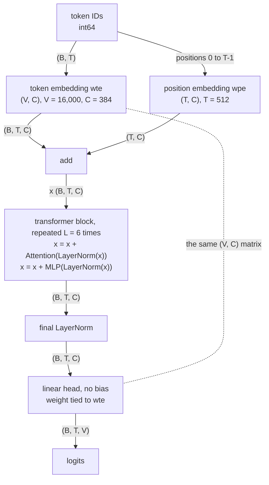

# Model overview

The `base` model from token IDs to logits, with the tensor shape on every arrow; it illustrates `05-model-architecture.md` §4.1 (the block itself is drawn in `02-block-and-attention.md`).

<!-- Sources: 05-model-architecture.md §4.1 (flow and shapes), §4.6 (weight tying), §4.4 (no bias), §4.5 (wpe is Embedding(T, C)), §1 symbol table (V = 16,000 per ADR-0002 Amendment 1, C = 384, T = 512, L = 6), §3 decisions. -->

Reads with: `docs/05-model-architecture.md` §4.1 and §4.6.
