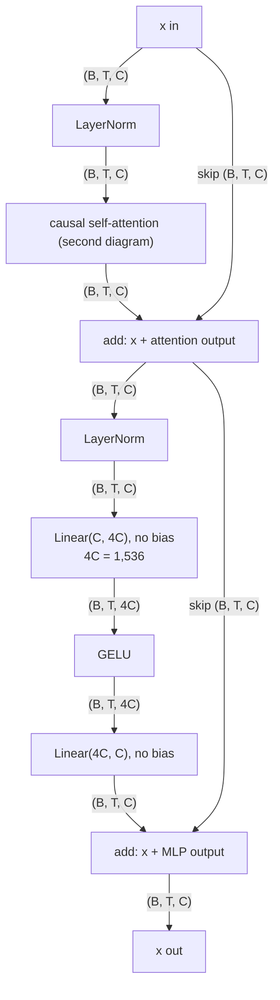
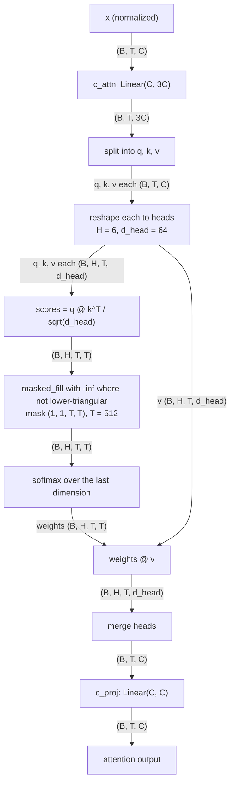

# Block and attention

The pre-LayerNorm residual wiring of one block and the explicit causal self-attention inside it, with the lower-triangular mask and the MLP expansion; it illustrates `05-model-architecture.md` §4.2 to §4.4.

<!-- Sources: 05-model-architecture.md §4.2 (pre-LN wiring, residual adds, no bias), §4.3 (attention steps, shapes, mask (1, 1, T, T), no attention dropout), §4.4 (MLP Linear(C, 4C), GELU, Linear(4C, C), width 1,536), §1 symbol table and §3 (C = 384, H = 6, d_head = 64, T = 512). -->

Reads with: `docs/05-model-architecture.md` §4.2 to §4.4.
