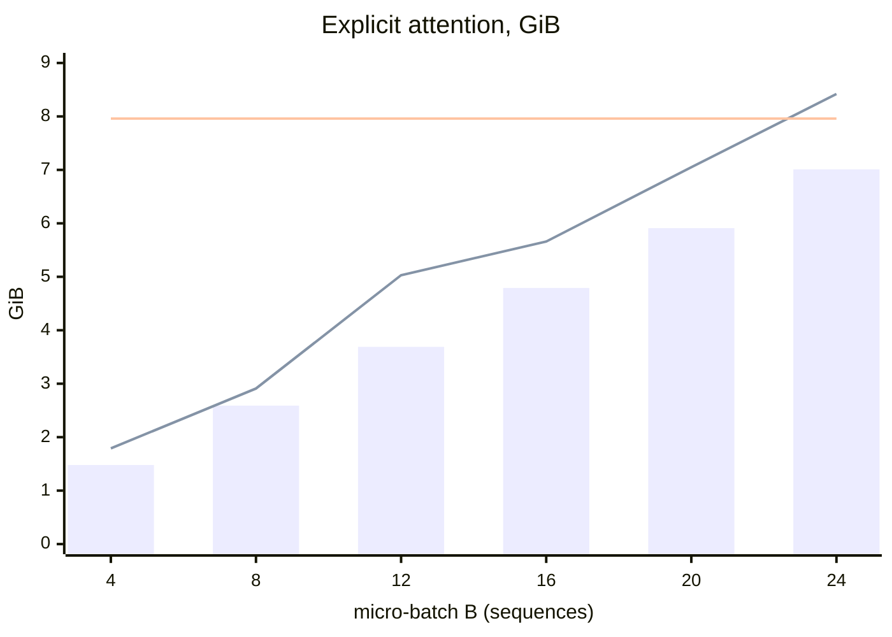
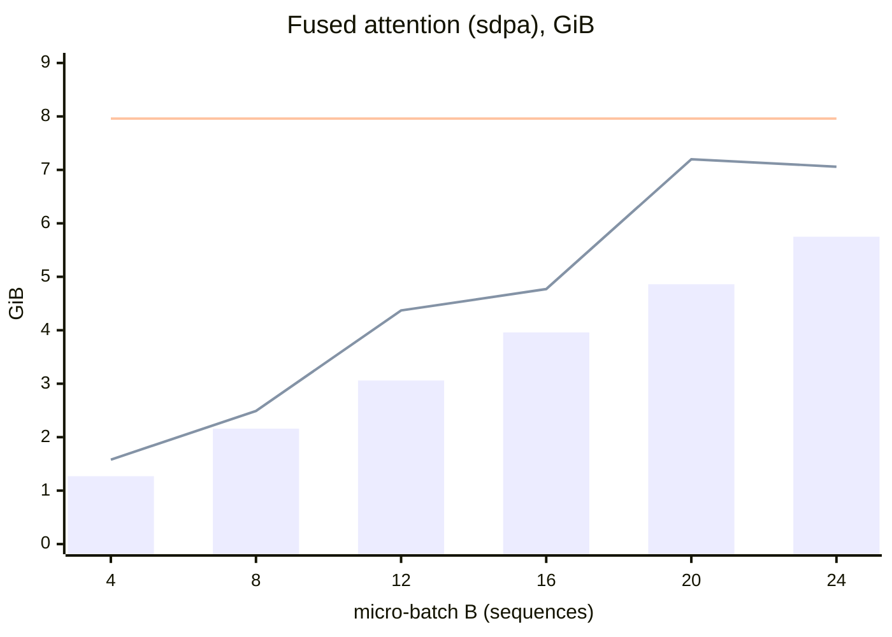

# Memory against micro-batch

Peak GPU memory against micro-batch size for the two attention implementations, measured at V = 32,000, with the card's 7.96 GiB limit and the spill at B = 24 for the explicit version (8.42 GiB reserved); it illustrates `05-model-architecture.md` §8.2.

Explicit attention (the implementation chosen for v1): bars are peak allocated, the rising line is peak reserved, the flat line is the 7.96 GiB limit.

`scaled_dot_product_attention` (kept behind `attention: sdpa`): same encoding.

<!-- Sources: 05-model-architecture.md §8.2 (the table of peak allocated / reserved GiB for B = 4, 8, 12, 16, 20, 24, both attention paths; measured at T = 512, V = 32,000; the 7.96 GiB limit and the explicit version's 8.42 GiB reserved at B = 24, where throughput falls from 63k to 37k tokens/s; B = 16 chosen). At the chosen V = 16,000 the real pipeline measures 3.31 GiB allocated and 3.68 GiB reserved at B = 16 (06-training-plan.md §5, 05 §8.2). -->

Reads with: `docs/05-model-architecture.md` §8.2 and `docs/06-training-plan.md` §5.
