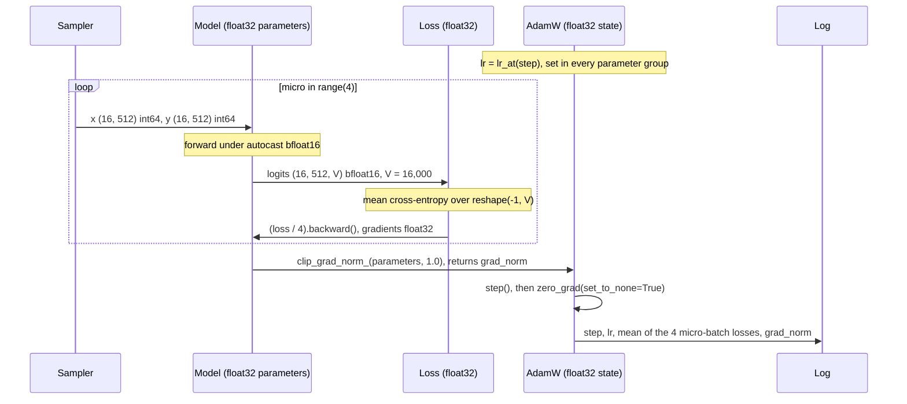

# One optimizer step

One optimizer step of 4 accumulated micro-batches (32,768 tokens), with tensor shapes and the float32 / bfloat16 boundaries; it illustrates `06-training-plan.md` §4.2.

<!-- Sources: 06-training-plan.md §4.2 (the loop, shapes (16, 512), loss / 4, clip 1.0, zero_grad(set_to_none=True), logged loss is the mean of the 4 micro-batch losses), §4.5 (micro-batch 16 x 4 accumulation = 32,768 tokens per step), 05-model-architecture.md §4.8 (parameters, gradients, AdamW state float32; forward and loss under bfloat16 autocast; logits bfloat16; loss float32; no scaler), V = 16,000 per ADR-0002 Amendment 1. -->

Reads with: `docs/06-training-plan.md` §4.2 and `docs/05-model-architecture.md` §4.8.
