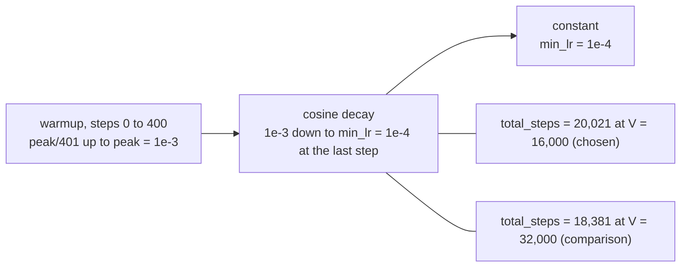
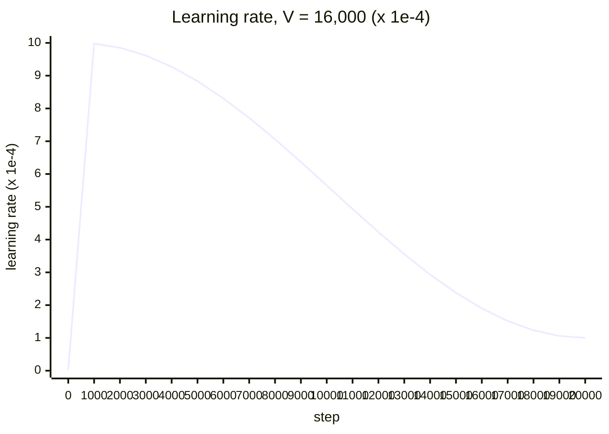

# Learning-rate schedule

Linear warmup of 400 steps, cosine decay to 1e-4 over the whole run, then constant, with the run lengths at V = 16,000 and V = 32,000; it illustrates `06-training-plan.md` §4.4.

The curve at V = 16,000 (20,021 steps), sampled every 1,000 steps; the unit is 1e-4, so 10 is the peak 1e-3 and 1 is the minimum 1e-4.

<!-- Sources: 06-training-plan.md §4.4 (warmup 400 steps from peak/401 to peak, then cosine decay to min_lr at the last step, then constant min_lr; peak 1e-3, minimum 1e-4; cycle over the whole run; total_steps 20,021 at V = 16,000 and 18,381 at 32,000), §5 (the step counts). The plotted values are computed from that formula (lr = peak * (step + 1) / 401 during warmup; min + 0.5 * (1 + cos(pi * (step - 400) / (total_steps - 1 - 400))) * (peak - min) afterwards) and are an illustration, not measurements. -->

Reads with: `docs/06-training-plan.md` §4.4 and §5.
