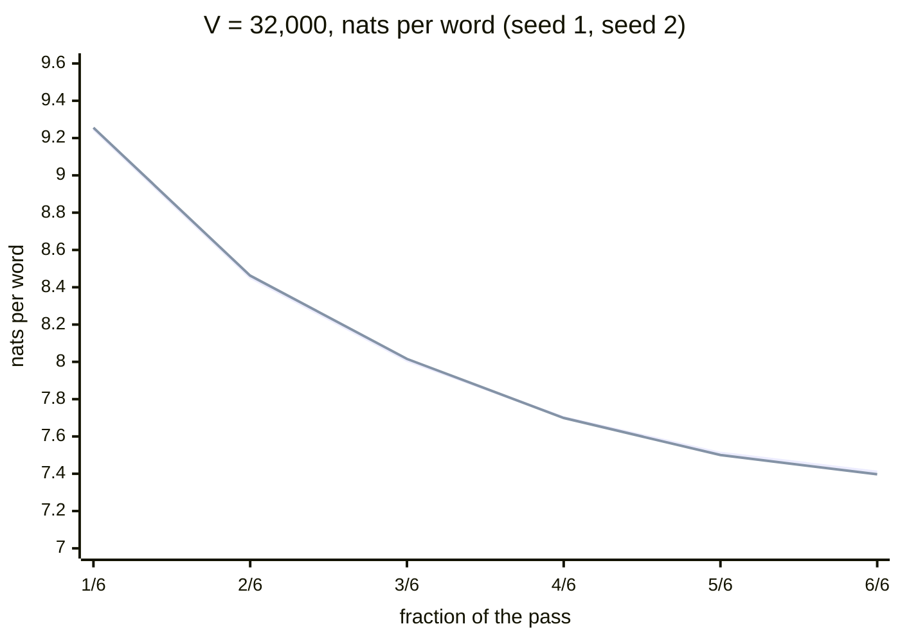
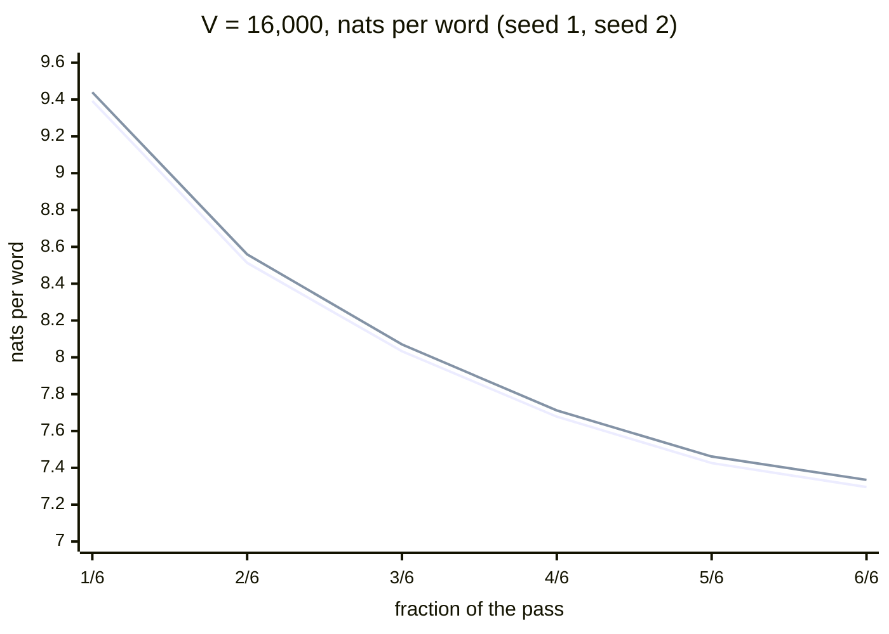
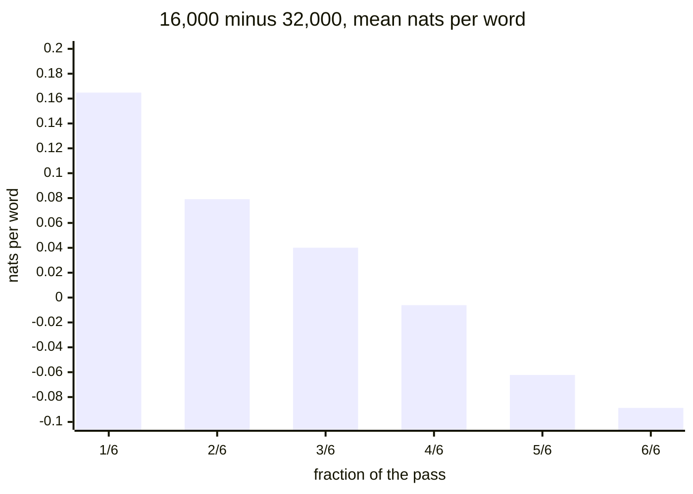

# Vocabulary pilot curves

Validation loss per word at 1/6 to 6/6 of the pass for the four scratchpad pilot runs (two seeds at V = 32,000 and two at V = 16,000), and the 16k-minus-32k difference that crosses zero at 4/6; it illustrates `06-training-plan.md` §7.2 (preliminary: scratchpad, not the production pipeline).

V = 32,000, seed 1 (first line) and seed 2 (second line):

V = 16,000, seed 1 (first line) and seed 2 (second line):

Difference of the means of two seeds, 16,000 minus 32,000 (positive: 16k is worse, negative: 16k is better; the crossing is at 4/6):

<!-- Sources: 06-training-plan.md §7.2 (the table of validation loss per word at 1/6 to 6/6 for 32k seeds 1 and 2 and 16k seeds 1 and 2; final means 7.4037 at 32k and 7.3150 at 16k, a gap of 0.089; 16k overtakes at 4/6), §7.1 (matched on text, two seeds per vocabulary), §7.4 (V = 16,000 decided). The difference series is computed from the table: mean of the two 16k seeds minus mean of the two 32k seeds, rounded to four decimals. Preliminary: scratchpad code and trial tokenizers. -->

Reads with: `docs/06-training-plan.md` §7.
