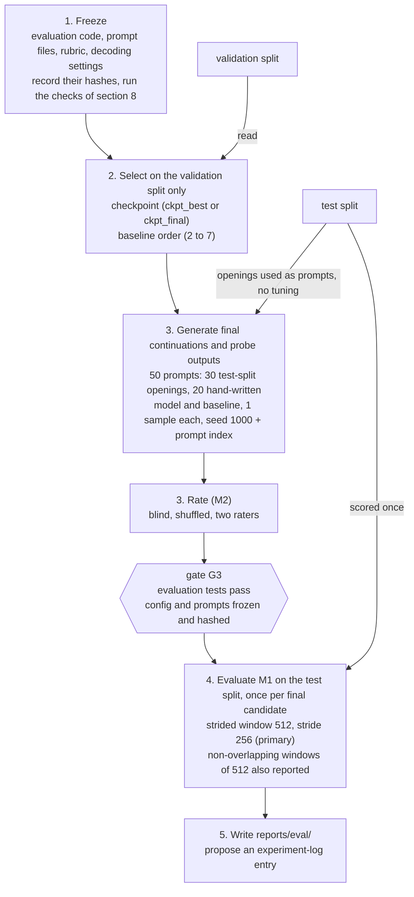

# Evaluation pipeline and test-split discipline

The order of operations of the evaluation and which split each step may touch: everything is chosen on the validation split, the evaluation items are frozen, and the test split is scored once; it illustrates `07-evaluation-plan.md` §7 (with the scoring of §4.3).

<!-- Sources: 07-evaluation-plan.md §7 (steps 1 to 5 and the rule that anything found after step 4 is reported as a deviation), §2 EV2 (test split never used for tuning, choosing a checkpoint, the baseline's order, or decoding settings), §4.3 (strided protocol 512 / 256 primary, non-overlapping 512 also computed), §4.4 (baseline order chosen on validation among 2 to 7), §5.1 (50 final prompts: 30 from the test split, 20 hand-written), §5.2 (seed 1000 + prompt index, 1 sample per prompt), 08-testing-strategy.md §5.2 (gate G3: before the test split is read), 11-roadmap.md §8 (G3 on 2026-10-23). -->

Reads with: `docs/07-evaluation-plan.md` §7, §4.3 and §5.1.
