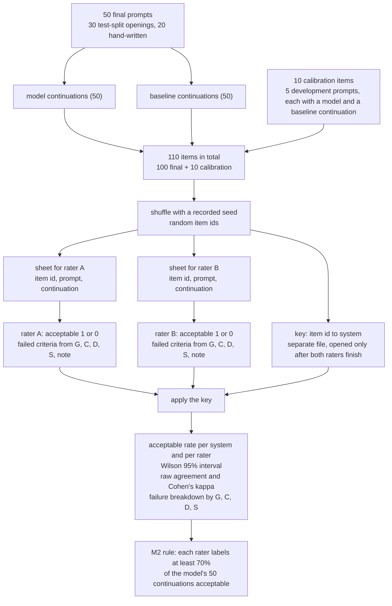

# M2 rating workflow

How the 50 final prompts become two blind, shuffled rating sheets and a separate key, and how the ratings become acceptable rates, Wilson intervals and Cohen's kappa; it illustrates `07-evaluation-plan.md` §5.4 and §5.5.

<!-- Sources: 07-evaluation-plan.md §5.4 (steps 1 to 6: 100 items plus 10 calibration items, shuffled with a recorded seed, random item ids, one sheet per rater, the key in a separate file, columns acceptable / failed / note, raters work separately), §5.3 (criteria G, C, D, S; calibration round of 10 items, 5 development prompts each with a model and a baseline continuation), §5.1 (50 final prompts: 30 test-split, 20 hand-written), §5.5 (Wilson 95% interval, raw agreement and Cohen's kappa, failure breakdown, M2 rule E11: each rater at least 70% of the model's 50 continuations). -->

Reads with: `docs/07-evaluation-plan.md` §5.3 to §5.5.
