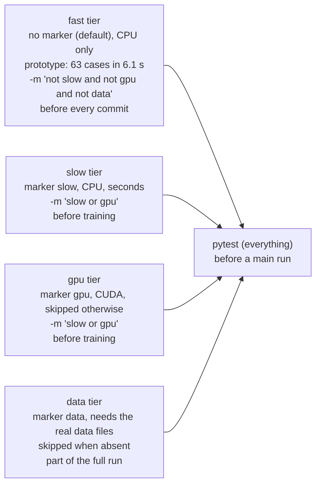
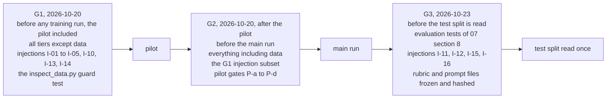

# Test tiers and gates

The four test tiers with their markers, commands and what they need, and gates G1, G2 and G3 on the project timeline with what must pass at each; it illustrates `08-testing-strategy.md` §4.1, §4.2 and §5.2.

<!-- Sources: 08-testing-strategy.md §4.1 (tiers, markers, needs, prototype times), §4.2 (the three pytest commands), §5.2 (gates G1, G2, G3 and what must pass; G2 reduced to the G1 injection subset, Part D), 11-roadmap.md §7.1 and §8 (dates: G1 on 10-20, G2 on 10-20 after the pilot, G3 on 10-23; 2026), 06-training-plan.md §6 (pilot gates P-a to P-d). -->

Reads with: `docs/08-testing-strategy.md` §4 and §5.2, and `docs/11-roadmap.md` §8.
