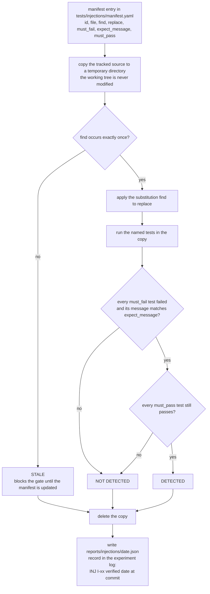

# Bug-injection procedure

What the injection runner does for one manifest entry, from the temporary copy to DETECTED, NOT DETECTED or STALE; it illustrates `08-testing-strategy.md` §6.2 and §6.3.

<!-- Sources: 08-testing-strategy.md §6.2 (no switches in production code; manifest and runner steps; entry fields; STALE when the anchor no longer matches; the runner prints DETECTED, NOT DETECTED or STALE and exits non-zero for the last two; results written to reports/injections/<date>.json), §6.3 (the record format "INJ I-xx verified <date> at <commit>: detected by <test id> with message"). -->

Reads with: `docs/08-testing-strategy.md` §6.2 and §6.3.
