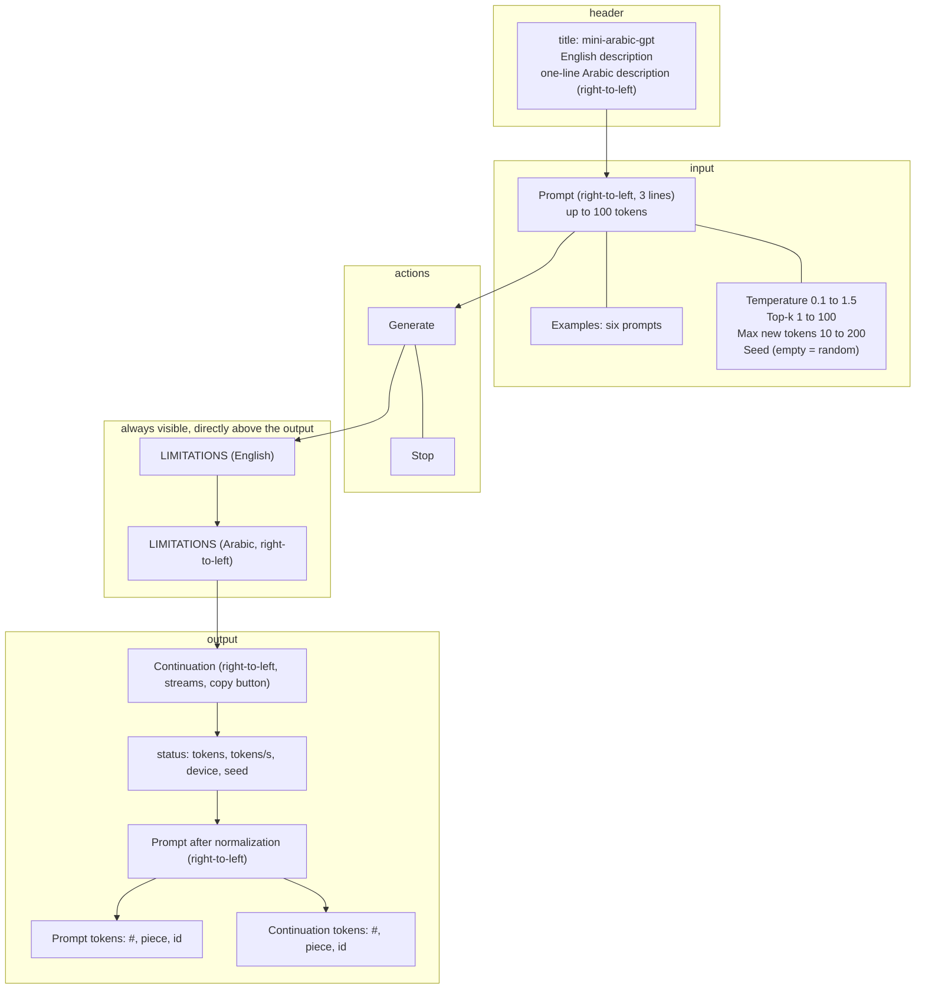

# Interface layout

The wireframe of the local Gradio demo from top to bottom, with the limitations text directly above the output and the right-to-left fields marked; it illustrates `09-ui-spec.md` §5.1.

<!-- Sources: 09-ui-spec.md §5.1 (layout), §5.2 (components: slider ranges, rtl fields, six examples, Stop button, status line, two token tables), §5.3 (limitations text in English and Arabic, one file app/limitations.md, placed immediately before the output), UR4 and UR6 in §3 (100-token prompt cap; limitations directly above the output). -->

Reads with: `docs/09-ui-spec.md` §5.1 and §5.2.
