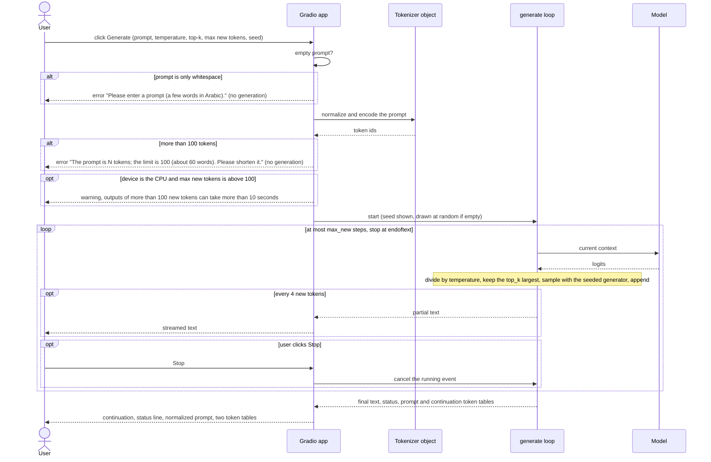

# Request flow

What happens between a click on Generate and the final status and token tables: validation, normalization and encoding, the generation loop with streaming, and Stop cancelling the loop; it illustrates `09-ui-spec.md` §5.4 and §6.1.

<!-- Sources: 09-ui-spec.md §6.1 (steps 1 to 5: normalize and encode; more than 100 tokens, or none, is rejected; loop for at most max_new steps with temperature, top-k, seeded sampling, stop at <|endoftext|>; text yielded every 4 new tokens and once more at the end with the status and the two token tables; seed drawn at random once if empty and shown), §5.4 (the messages and the CPU warning above 100 new tokens), §5.2 (Stop cancels the running event), UR4 (100-token prompt cap). -->

Reads with: `docs/09-ui-spec.md` §5.4 and §6.1.
