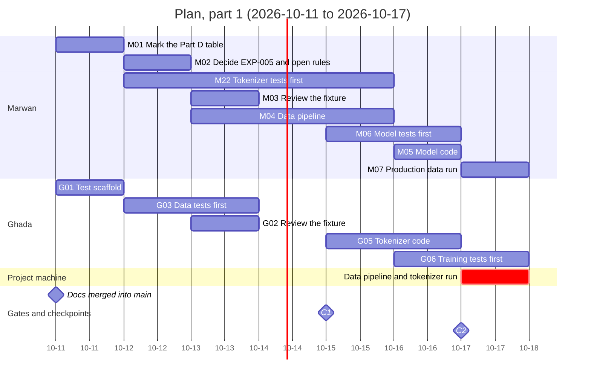
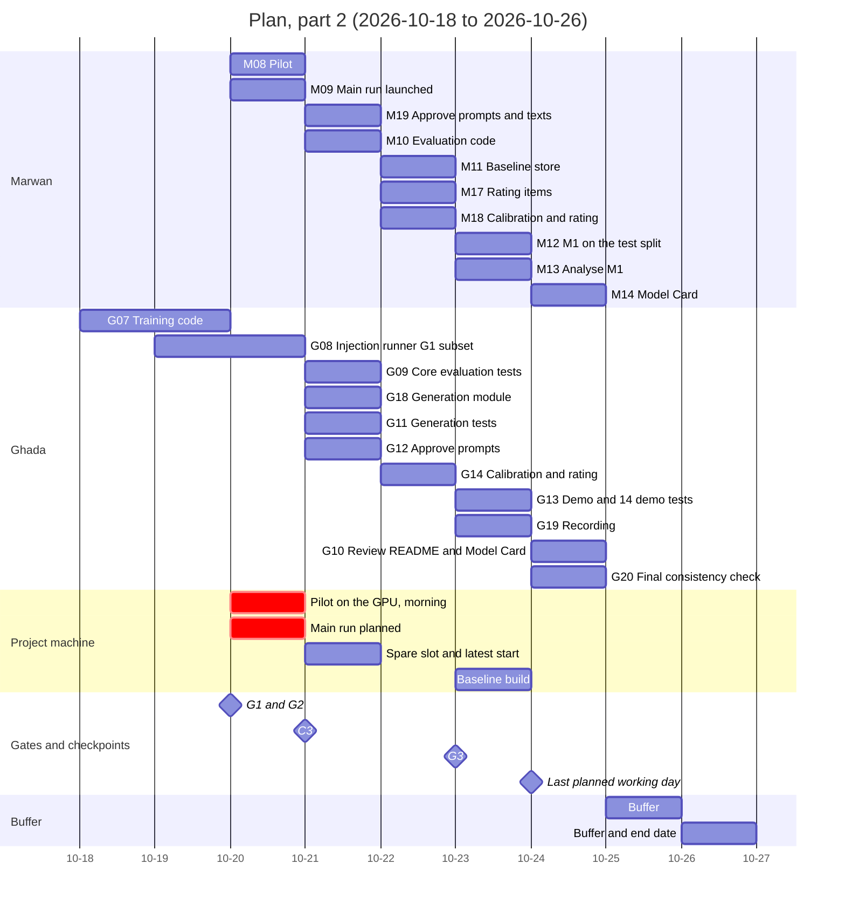

# Timeline

The plan of 2026-10-11 to 2026-10-26 as two Gantt charts (the first week, then the second), with the two people and the project machine as rows, the gates G1 to G3, the checkpoints C1 to C3, and the two buffer days; it illustrates `11-roadmap.md` §7.1 to §7.4 and §8.

Part 1, 2026-10-11 to 2026-10-17:

Part 2, 2026-10-18 to 2026-10-26:

<!-- Sources: 11-roadmap.md §7.1 (calendar, gates and checkpoints per date, buffer days 10-25 and 10-26, end date 10-26), §7.2 and §7.3 (task ids, owners, names, due dates; start dates are read from the calendar of §7.1 where it names a start, otherwise the bar spans the hours of the task ending on its due date), §7.4 (machine schedule: data run on 10-17, pilot on the morning of 10-20, main run 10-20 of about 2.6 h, spare slot on 10-21, baseline build on 10-23), §8 (C1 end of 10-15, C2 end of 10-17, G1 on 10-20, G2 on 10-20 after the pilot, C3 end of 10-21, G3 on 10-23). Year 2026. -->

Reads with: `docs/11-roadmap.md` §7 and §8.
