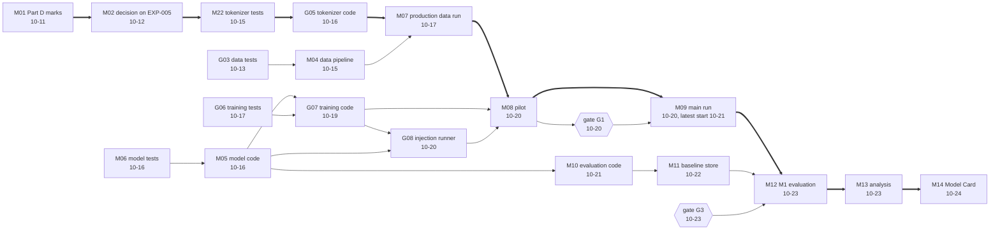

# Critical path

The dependency graph of the plan: the critical path (thick arrows) from the Part D marks to the Model Card, the parallel branches that join at the pilot, and the evaluation branch that joins at the M1 evaluation; it illustrates `11-roadmap.md` §7.5.

<!-- Sources: 11-roadmap.md §7.5 (the critical path M01 to M14 and the parallel branches joining at the pilot and the evaluation branch joining at the M1 evaluation), §7.2 (the "Needs" column: M02 needs M01, M22 needs M02, G05 needs M22, M07 needs M04 and G05, M04 needs G03, M05 needs M06, G07 needs G06 and M05, G08 needs G07 and M05, M08 needs G07, G08 and M07, M09 needs M08, M10 needs M05, M11 needs M10, M12 needs the main run, M11 and gate G3, M13 needs M12, M14 needs M13) and due dates, §8 (G1 on 10-20, G3 on 10-23; the main run starts only after G1, RM1). G01 (test scaffold) is a need of the tests and is omitted. -->

Reads with: `docs/11-roadmap.md` §7.5.
